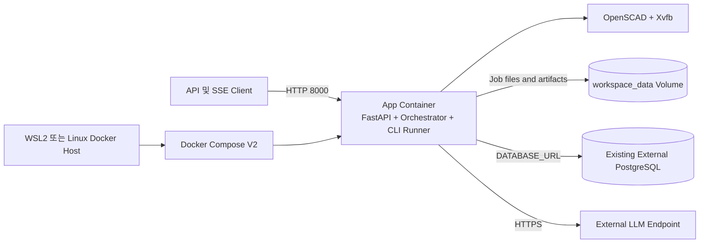

# 배포 아키텍처 - Hotfix R-13 Linux/Docker Runtime

## 아키텍처 다이어그램



## 텍스트 대체 표현

1. WSL2 또는 Linux host에서 Docker Compose V2를 실행한다.
2. Compose는 FastAPI, Orchestrator, CLI Runner가 함께 있는 앱 컨테이너 하나를 시작한다.
3. 앱 컨테이너 내부 OpenSCAD는 Xvfb를 통해 headless로 실행된다.
4. Job과 artifact 파일은 `workspace_data` named volume에 저장된다.
5. 앱은 runtime `DATABASE_URL`로 기존 외부 PostgreSQL에 연결한다.
6. 앱은 HTTPS로 외부 LLM endpoint를 호출한다.
7. 클라이언트는 host port 8000을 통해 API와 SSE에 연결한다.

## 실행 흐름

### Startup

1. Compose가 `.env`의 runtime 설정을 app service에 주입한다.
2. app container가 비루트 사용자로 Uvicorn single worker를 시작한다.
3. FastAPI lifespan이 외부 DB 연결과 schema 준비를 수행한다.
4. healthcheck가 root endpoint 응답을 확인한다.
5. 서비스가 healthy 상태가 되면 API 요청을 처리한다.

### Job Execution

1. `POST /api/v1/jobs`가 DB row와 volume의 Job workspace를 생성한다.
2. background Orchestrator가 LLM action plan을 생성·검증한다.
3. 파일 action은 `/app/.workspaces/jobs/{job_id}`에 기록된다.
4. RUN_TOOL은 같은 Job 경로를 `cwd`로 설정해 headless OpenSCAD를 실행한다.
5. CLI output과 상태 이벤트는 외부 DB에 기록된다.
6. artifact는 volume의 artifact 디렉터리에 보존된다.
7. 실패 시 EventLog와 container ERROR traceback을 모두 남긴다.

## Compose 논리 명세

```yaml
services:
  app:
    build: .
    env_file:
      - .env
    ports:
      - "${APP_PORT:-8000}:8000"
    volumes:
      - workspace_data:/app/.workspaces
    restart: unless-stopped
    user: "10001:10001"
    security_opt:
      - no-new-privileges:true
    cap_drop:
      - ALL
    cpus: 2.0
    mem_limit: 2g
    healthcheck:
      test: ["CMD", "python", "-c", "import urllib.request; urllib.request.urlopen('http://127.0.0.1:8000/', timeout=3)"]
      interval: 30s
      timeout: 5s
      retries: 3
      start_period: 20s

volumes:
  workspace_data:
```

이 YAML은 설계 명세이며 Code Generation에서 Compose 구문 검증 후 실제 파일로 생성한다.

## 환경 변수 경계

| 변수 | 출처 | 이미지 포함 | 로그 출력 |
| --- | --- | --- | --- |
| `DATABASE_URL` | runtime `.env` | 금지 | 금지 |
| `LLM_API_KEY` | runtime `.env` | 금지 | 금지 |
| `LLM_ENDPOINT` | runtime `.env` | 금지 | hostname 수준만 허용 |
| `LLM_MODEL` | runtime `.env` | 금지 | 허용 가능 |
| `SSE_STREAM_TOKEN_SECRET` | runtime `.env` | 금지 | 금지 |
| `APP_ENV` | runtime `.env` | 금지 | 허용 |
| `OPENSCAD_BIN_PATH` | Compose 고정값 | 허용 | 허용 |

## 검증 지점

- `docker compose config`: YAML과 단일 service 구조 검증
- `docker compose build`: 이미지와 dependency 설치 검증
- container `id`: 비루트 UID 10001 검증
- container `openscad-headless --version`: OpenSCAD adapter 검증
- 최소 STL 및 PNG 생성: headless rendering 검증
- `docker compose ps`: healthcheck 검증
- container 재생성 후 workspace 파일 유지: volume 검증
- 잘못된 외부 DB URL로 startup log 확인: 오류 관측성 검증

## 운영 제약

- `docker compose up --scale app=2`는 지원하지 않는다.
- `docker compose down -v`는 workspace 데이터를 삭제하므로 기본 종료 절차에 사용하지 않는다.
- host DB가 `localhost`에만 bind되어 있으면 container에서 접근할 수 없으므로 DB listen 및 firewall 설정이 별도로 필요할 수 있다.
- TLS termination과 공개 인터넷 노출은 상위 배포 환경의 책임이다.
