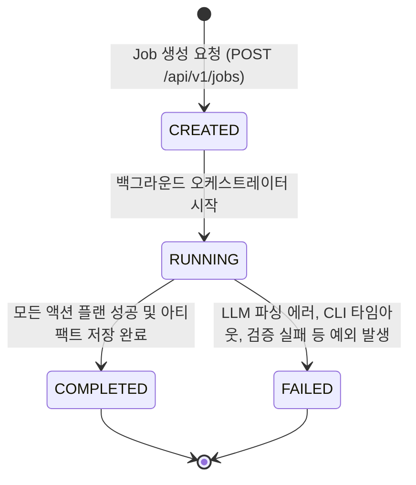
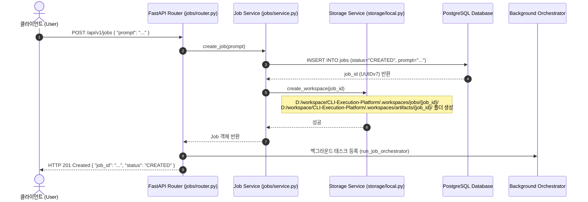
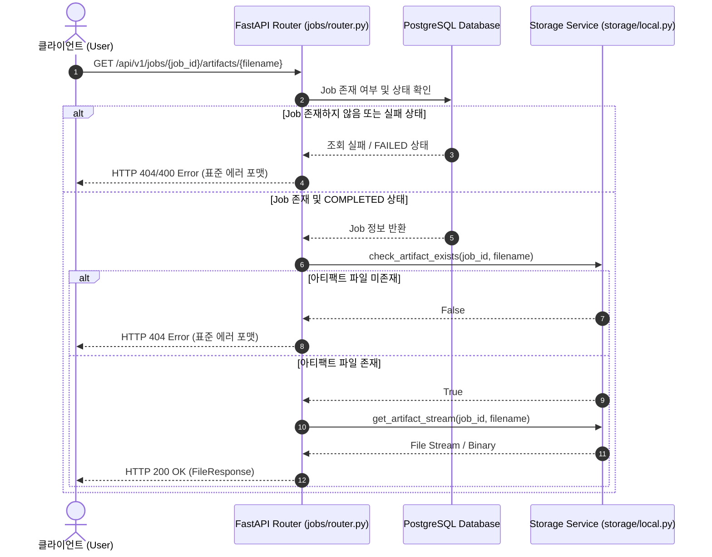

# 비즈니스 논리 모델 (Business Logic Model) - Unit 1: API Core & Storage Service

본 문서는 **Unit 1: API Core & Storage Service**의 핵심 비즈니스 생애주기(Job Lifecycle)와 작업 공간(Workspace) 초기화, 그리고 결과 아티팩트(Artifact) 조회 비즈니스 논리의 흐름을 명세합니다.

---

## 1. Job 상태 전이 모델 (Job State Transition Model)

비동기로 처리되는 작업(Job)은 생성부터 완료/실패에 이르기까지 다음과 같은 상태 전이 단계를 가집니다.

* **CREATED (생성됨)**: 사용자의 자연어 요청을 받아 DB에 Job 레코드가 삽입되고, 물리적 로컬 작업 공간(Workspace) 폴더 생성이 완료된 초기 상태입니다.
* **RUNNING (실행 중)**: 백그라운드 프로세스가 시작되어 LLM API 호출, 액션 플랜 수립, 보안 검증, OpenSCAD CLI 실행 등이 진행 중인 상태입니다.
* **COMPLETED (성공 완료)**: OpenSCAD CLI 실행 결과로 생성된 최종 아티팩트(예: `.stl`, `.png`)가 영구 아티팩트 저장소에 안전하게 복사/이관되어 사용자가 다운로드할 수 있는 상태입니다.
* **FAILED (실패)**: 처리 도중 예외가 발생하거나, CLI 실행 시간이 초과(30초)되었거나, 보안 정책 위반(Directory Traversal 시도 등)이 감지되어 중단된 상태입니다.

---

## 2. Job 생성 및 Workspace 초기화 라이프사이클 흐름 (Sequence Diagram)

클라이언트의 요청을 받아 동기적으로 Job과 Workspace를 생성하고 백그라운드 작업을 실행하는 흐름입니다.

### 상세 단계 설명
1. **POST 요청 수신**: 사용자가 자연어 디자인 요구사항이 담긴 프롬프트를 전송합니다.
2. **Job 데이터베이스 영속화**: `jobs` 테이블에 신규 Job 레코드를 생성하고 상태를 `CREATED`로 설정합니다.
3. **Workspace 물리 디렉토리 생성**: `LocalStorageService`를 활용해 프로젝트 루트 하위 `.workspaces` 폴더 내에 해당 `job_id` 전용의 임시 작업 폴더(`jobs/{job_id}`)와 영구 아티팩트 저장 폴더(`artifacts/{job_id}`)를 생성합니다.
4. **비동기 핸들러 백그라운드 이관**: FastAPI의 `BackgroundTasks`에 오케스트레이터 메서드를 등록하여 클라이언트에게는 즉시 응답(HTTP 201)을 보내고, 실제 무거운 작업은 백그라운드에서 실행시킵니다.

---

## 3. 아티팩트 다운로드 비즈니스 논리 흐름 (Artifact Retrieval Flow)

생성이 완료된 아티팩트를 안전하게 다운로드하기 위한 비즈니스 로직입니다.

### 상세 단계 설명
1. **아티팩트 요청**: 사용자가 특정 `job_id`와 다운로드하고자 하는 `filename`(예: `model.stl`)을 명시하여 요청합니다.
2. **Job 검증**: 데이터베이스에서 해당 `job_id`를 조회해 유효한 Job인지 확인합니다.
3. **물리 아티팩트 존재 여부 검증**: `LocalStorageService`를 통해 영구 보관 폴더(`.workspaces/artifacts/{job_id}/{filename}`)에 파일이 실제로 존재하는지 체크합니다. 이때 디렉토리 상위 탐색(`../`) 등의 경로 조작을 원천 차단하는 검증이 수행됩니다.
4. **스트리밍 응답**: 파일이 존재하는 경우 FastAPI의 `FileResponse`를 활용하여 버퍼 스트리밍 형식으로 안전하게 다운로드를 제공합니다.
