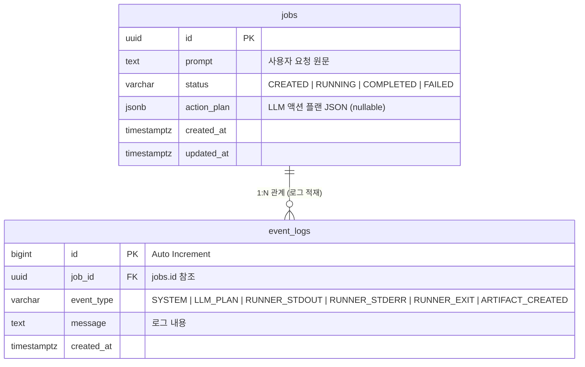

# 도메인 엔티티 정의서 (Domain Entities) - Unit 1: API Core & Storage Service

본 문서는 **Unit 1: API Core & Storage Service**에서 사용되는 관계형 데이터베이스(PostgreSQL) 테이블 스키마, SQLAlchemy ORM 모델 명세, 그리고 API 입출력을 위한 Pydantic DTO 스펙을 정의합니다.

---

## 1. 물리 데이터베이스 스키마 (Physical DB Schema)

PostgreSQL 기반의 테이블 구조 설계입니다.



### 1.1 `jobs` 테이블 상세 사양
* **역할**: 비동기 CLI 실행 작업의 기본 메타데이터 및 LLM이 도출한 액션 플랜을 저장합니다.

| 컬럼명 | 데이터 타입 | 제약 조건 | 설명 |
| :--- | :--- | :--- | :--- |
| `id` | `UUID` | Primary Key (Application-generated: UUIDv7) | 시간 순서 정렬이 가능한 고유 식별자 |
| `prompt` | `TEXT` | NOT NULL | 사용자가 입력한 자연어 명령어 |
| `status` | `VARCHAR(50)` | NOT NULL (Default: `'CREATED'`) | 작업 상태 (`CREATED`, `RUNNING`, `COMPLETED`, `FAILED`) |
| `action_plan` | `JSONB` | NULLABLE | LLM이 파싱하여 반환한 작업 계획 목록 (Pydantic 구조) |
| `created_at` | `TIMESTAMPTZ` | NOT NULL (Default: `CURRENT_TIMESTAMP`) | 작업 생성 일시 |
| `updated_at` | `TIMESTAMPTZ` | NOT NULL (Default: `CURRENT_TIMESTAMP`) | 마지막 상태 갱신 일시 |

* **인덱스**:
  * `pk_jobs`: `id` (Primary Key Index)

### 1.2 `event_logs` 테이블 상세 사양
* **역할**: 특정 Job의 수행 과정에서 발생한 시스템 로그 및 CLI 프로세스의 출력 로그를 시간 순서대로 적재합니다. SSE를 통한 실시간 로그 스트리밍의 원천 데이터로 사용됩니다.

| 컬럼명 | 데이터 타입 | 제약 조건 | 설명 |
| :--- | :--- | :--- | :--- |
| `id` | `BIGINT` | Primary Key (Serial / Auto Increment) | 로그 레코드의 고유 식별자 |
| `job_id` | `UUID` | Foreign Key (`jobs.id` CASCADE ON DELETE) | 해당 로그가 속한 Job의 ID |
| `event_type` | `VARCHAR(50)` | NOT NULL | 이벤트 성격 구분 |
| `message` | `TEXT` | NOT NULL | 실제 로그 출력 메시지 |
| `created_at` | `TIMESTAMPTZ` | NOT NULL (Default: `CURRENT_TIMESTAMP`) | 로그 적재 일시 |

* **인덱스**:
  * `pk_event_logs`: `id` (Primary Key Index)
  * `idx_event_logs_job_id_id`: `(job_id, id)` 결합 인덱스 (특정 Job의 로그를 ID 순서대로 고속 조회 및 Polling 하기 위함)

---

## 2. SQLAlchemy ORM 모델 매핑 (Python ORM Model)

Python 소스 코드 수준에서 구현될 SQLAlchemy 2.0 선언적 스타일(Declarative Style)의 매핑 정의입니다.

```python
import uuid
from datetime import datetime
from typing import Any, Dict, List, Optional
from sqlalchemy import BigInteger, ForeignKey, String, Text, DateTime, func
from sqlalchemy.dialects.postgresql import JSONB, UUID
from sqlalchemy.orm import DeclarativeBase, Mapped, mapped_column, relationship
from uuid6 import uuid7  # 시간 순 정렬이 가능한 UUIDv7 생성을 위해 사용

class Base(DeclarativeBase):
    pass

class Job(Base):
    __tablename__ = "jobs"

    id: Mapped[uuid.UUID] = mapped_column(
        UUID(as_uuid=True), primary_key=True, default=uuid7
    )
    prompt: Mapped[str] = mapped_column(Text, nullable=False)
    status: Mapped[str] = mapped_column(String(50), default="CREATED", nullable=False)
    action_plan: Mapped[Optional[List[Dict[str, Any]]]] = mapped_column(
        JSONB, nullable=True
    )
    created_at: Mapped[datetime] = mapped_column(
        DateTime(timezone=True), server_default=func.now(), nullable=False
    )
    updated_at: Mapped[datetime] = mapped_column(
        DateTime(timezone=True), server_default=func.now(), onupdate=func.now(), nullable=False
    )

    # 1대N 관계 매핑
    logs: Mapped[List["EventLog"]] = relationship(
        "EventLog", back_populates="job", cascade="all, delete-orphan"
    )

class EventLog(Base):
    __tablename__ = "event_logs"

    id: Mapped[int] = mapped_column(BigInteger, primary_key=True, autoincrement=True)
    job_id: Mapped[uuid.UUID] = mapped_column(
        UUID(as_uuid=True), ForeignKey("jobs.id", ondelete="CASCADE"), nullable=False
    )
    event_type: Mapped[str] = mapped_column(String(50), nullable=False)
    message: Mapped[str] = mapped_column(Text, nullable=False)
    created_at: Mapped[datetime] = mapped_column(
        DateTime(timezone=True), server_default=func.now(), nullable=False
    )

    # N대1 관계 매핑
    job: Mapped["Job"] = relationship("Job", back_populates="logs")
```

---

## 3. Pydantic DTO 스키마 (API Request / Response Schemas)

FastAPI의 입출력 검증 및 응답 직렬화(Serialization)를 위한 Pydantic 2.x 스키마 설계입니다.

### 3.1 Job 생성 요청 및 응답

```python
from pydantic import BaseModel, Field
from typing import Any, Dict, List, Optional
from uuid import UUID
from datetime import datetime

# POST /api/v1/jobs 요청 스키마
class JobCreateRequest(BaseModel):
    prompt: str = Field(
        ..., 
        min_length=5, 
        max_length=1000, 
        examples=["샤오미 워치 S4 충전 도킹스테이션 설계도를 만들어줘"]
    )

# Job 기본 응답 스키마
class JobResponse(BaseModel):
    id: UUID
    prompt: str
    status: str
    action_plan: Optional[List[Dict[str, Any]]] = None
    created_at: datetime
    updated_at: datetime

    class Config:
        from_attributes = True
```

### 3.2 API 표준 에러 응답 포맷 (REST Error Schema)

비즈니스 요건에 의해 커스텀 구성된 에러 스키마입니다.

```python
# API 표준 에러 응답 포맷
class ErrorDetail(BaseModel):
    status: str = Field("error", description="에러 고정 상태 값")
    code: str = Field(..., description="내부 비즈니스 에러 코드 (예: NOT_FOUND, VALIDATION_ERROR)")
    message: str = Field(..., description="사용자 친화적인 에러 설명 메시지")

class ErrorResponse(BaseModel):
    detail: ErrorDetail
```
