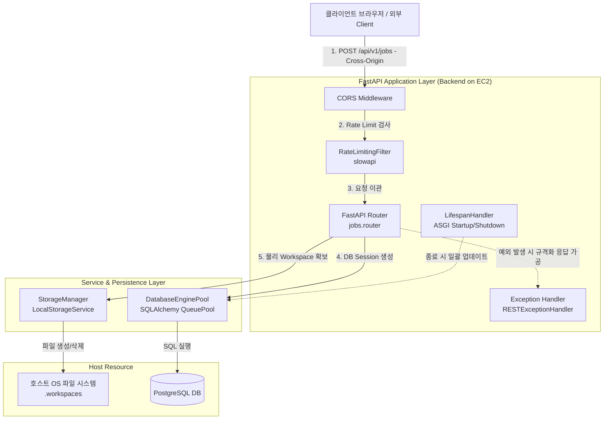

# 논리 아키텍처 컴포넌트 명세 (Logical Components) - Unit 1: API Core & Storage Service

본 문서는 **Unit 1: API Core & Storage Service**의 비기능 요구사항을 물리 코드 계층으로 매핑하기 위한 논리 아키텍처와 핵심 컴포넌트의 역할 및 연동 관계를 정의합니다.

---

## 1. Unit 1 논리 컴포넌트 아키텍처 (Component Architecture)

---

## 2. 핵심 논리 컴포넌트 명세 (Component Details)

### 2.1 DatabaseEnginePool (데이터베이스 엔진 풀 컴포넌트)
* **논리적 역할**: PostgreSQL 인스턴스와의 통신 회선을 안정적으로 유지 및 관리하고 동시 커넥션 과다 생성을 제한합니다.
* **주요 명세**:
  * **Pool Type**: SQLAlchemy `QueuePool`
  * **Size Parameters**: 상시 2개, 최대 여유분 3개 (최대 5개의 고정 풀 라인 유지)
  * **Pre-ping Ping-check**: 커넥션 임대 직전 `SELECT 1` 경량 쿼리를 실행해 가상 환경 및 도커 네트워크 상의 데이터베이스 끊김을 방어.
* **관련 모듈**: `database.py` (또는 `jobs/models.py` 데이터베이스 초기화부)

### 2.2 RateLimitingFilter (속도 제한 필터)
* **논리적 역할**: 특정 클라이언트의 단기간 반복 호출을 제어하여 비싼 외부 리소스(LLM API 등)의 요금 및 서버 장애를 예방합니다.
* **주요 명세**:
  * **기술 구현**: Python `slowapi` 라이브러리의 `Limiter` 패키지.
  * **인터셉트 지점**: `POST /api/v1/jobs` 엔드포인트의 데코레이터 주입.
  * **제한 정책**: 단일 원격 IP 주소(`get_remote_address`)당 분당 최대 10회 실행 차단.
  * **보관 모델**: 인메모리 방식(`MemoryStorage`)을 탑재해 Redis 설치 오버헤드를 배제함.

### 2.3 StorageManager (LocalStorageService 구현체)
* **논리적 역할**: 로컬 파일 시스템 상의 물리적인 파일 생성, 조회, 디렉토리 생성 및 삭제를 담당하고 하위 경로 보안을 검증합니다.
* **주요 명세**:
  * **디렉토리 샌드박싱**: 결합된 물리 경로가 `.workspaces/jobs/{job_id}/` 내부인지 항상 확인하여 Directory Traversal 방어.
  * **즉각적 Workspace 정리**: 오케스트레이터 종료 시점에 `.workspaces/jobs/{job_id}` 임시 폴더 삭제.
* **관련 모듈**: `storage/local.py`

### 2.4 LifespanHandler (서버 수명 주기 관리자)
* **논리적 역할**: ASGI(FastAPI) 엔진의 생명 주기에 따라 서버 부팅 시와 셧다운 시 실행될 시스템 관리 액션을 수행합니다.
* **주요 명세**:
  * **lifespan Context**: FastAPI의 `lifespan` 파라미터 매핑.
  * **Graceful Shutdown**: 시스템 종료 요청(SIGTERM) 수신 시, `jobs` 테이블에서 실행 상태인 데이터를 조회하여 데이터베이스 트랜잭션을 FAILED로 갱신하고 정리 태스크 실행.

### 2.5 RESTExceptionHandler (전역 예외 가공기)
* **논리적 역할**: 애플리케이션 실행 도중 발생하는 다양한 런타임 예외들을 REST 표준 에러 규격에 맞게 변환하여 클라이언트에게 안전하게 반환합니다.
* **주요 명세**:
  * **가공 대상**: Pydantic `RequestValidationError`, `RateLimitExceeded`, `FileNotFoundError` 등.
  * **응답 포맷**: JSON 형식의 `{"detail": {"status": "error", "code": "...", "message": "..."}}` 통일.

### 2.6 CORSMiddleware (CORS 보안 필터)
* **논리적 역할**: 외부 도메인(S3 정적 호스팅 등)에 분리 배포된 프론트엔드 클라이언트 애플리케이션의 비동기 API 요청을 허용하고, 권한 없는 오리진으로부터의 무단 API 접근을 차단합니다.
* **주요 명세**:
  * **기술 구현**: FastAPI 내장 `CORSMiddleware` 적용.
  * **허용 정책**: `allow_origins` 리스트에 로컬 개발 웹 주소 및 상용 배포될 도메인을 설정하고, 허용할 HTTP 메서드(`GET`, `POST`, `OPTIONS`)와 헤더를 정의합니다.

