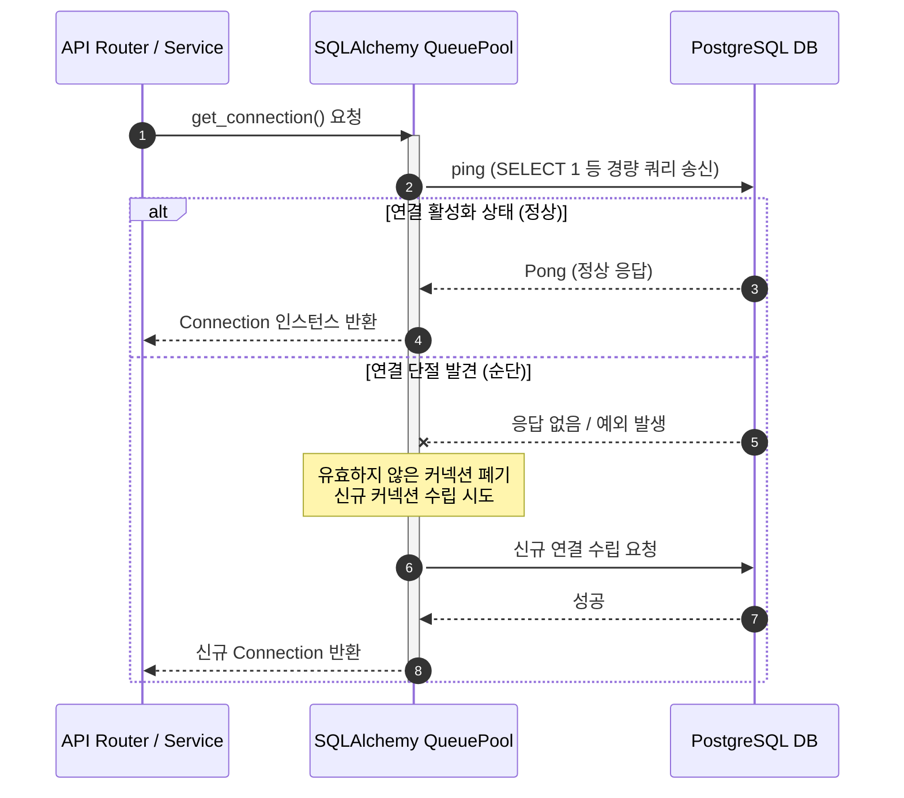
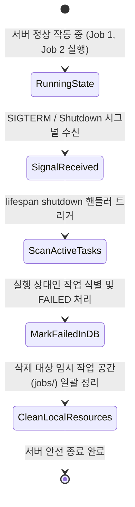

# 비기능 디자인 패턴 설계서 (NFR Design Patterns) - Unit 1: API Core & Storage Service

본 문서는 **Unit 1: API Core & Storage Service**의 비기능 요구사항을 달성하기 위해 적용된 소프트웨어 디자인 패턴 및 상태 복구 구조를 상세히 기술합니다.

---

## 1. 데이터베이스 가용성 및 재시도 디자인 패턴 (Resilience Pattern)

### 1.1 Fail-Fast 및 SQLAlchemy Pool Pre-ping 패턴
일시적인 데이터베이스 연결 단절이나 짧은 네트워크 순단에 아키텍처가 자가 복구할 수 있도록 SQLAlchemy의 내장 커넥션 풀 검증 메커니즘을 적용합니다.



* **적용 장점**: 비즈니스 로직이나 API 라우터 단에서 복잡하게 `tenacity` 등의 재시도(Retry) 프레임워크를 도입하지 않고, **커넥션 풀 계층(QueuePool)**에서 재연결을 투명하게 처리합니다. 
* **설정 방식**: `create_engine(..., pool_pre_ping=True)` 설정을 통해 커넥션을 반환하기 직전 검증을 강제하며, DB 서버 자체의 하드 오류로 인한 연결 불능 시에는 지체 없이 에러를 응답하여 스레드나 프로세스가 블로킹 대기 상태로 유지되는 현상을 방지(Fail-Fast)합니다.

---

## 2. 경로 조작 차단 보안 디자인 패턴 (Security Pattern)

### 2.1 Storage Service 내 물리 파일 I/O 캡슐화 (Strict Encapsulation)
임시 작업 공간 및 아티팩트 보관 폴더 이외의 시스템 영역으로 디렉토리를 이탈하는 공격을 방어하기 위해 검증 로직을 파일 시스템 접점 계층에 100% 캡슐화합니다.

```python
# StorageService 구현 내부에서의 캡슐화 설계 방식
from pathlib import Path
from uuid import UUID

class LocalStorageService:
    def __init__(self, base_workspace_dir: Path):
        self.base_dir = base_workspace_dir.resolve()

    def _validate_safe_path(self, job_id: UUID, relative_path: str) -> Path:
        # 1. 대상 물리 디렉토리 확인 (예: jobs/{job_id}/)
        job_dir = (self.base_dir / "jobs" / str(job_id)).resolve()
        
        # 2. 파일 최종 결합 경로 계산 및 resolve
        target_file_path = (job_dir / relative_path).resolve()
        
        # 3. Traversal 검증 (결합 경로가 job_dir 하위에 정상 종속되어 있는지 체크)
        if not target_file_path.is_relative_to(job_dir):
            raise PermissionError("Access Denied: Path traversal attempt detected.")
            
        return target_file_path
```

* **디자인 패턴 효과**: 외부 비즈니스 로직 모듈이나 컨트롤러 단에서 파일 읽기/쓰기를 처리할 때 매번 검증 함수를 직접 실행해 줄 필요가 없습니다. 파일의 생성 및 조회 입구(`LocalStorageService`)에서 항상 강제 실행되므로 **검증 누락으로 인한 보안 결함을 원천 차단**할 수 있습니다.

### 2.2 Cross-Origin Resource Sharing (CORS) 보안 패턴
프론트엔드와 백엔드 레포지토리가 분리되고 각각 AWS S3(정적 웹 호스팅/CloudFront) 및 EC2로 격리 배포됨에 따라, 서로 다른 오리진(Origin) 간의 브라우저 비동기 요청을 안전하게 허용하기 위한 CORS 미들웨어 패턴을 적용합니다.

```python
from fastapi.middleware.cors import CORSMiddleware

# 보안 관리를 위해 허용할 도메인(Origin) 리스트 지정
ALLOWED_ORIGINS = [
    "http://localhost:5173",               # 로컬 프론트엔드 개발(Vite React)용
    "https://your-frontend-s3-bucket...",  # 상용 배포된 S3 웹사이트 도메인
]

app.add_middleware(
    CORSMiddleware,
    allow_origins=ALLOWED_ORIGINS,
    allow_credentials=True,
    allow_methods=["GET", "POST", "OPTIONS"],  # Job 생성/조회 및 CORS preflight 허용
    allow_headers=["*"],
)
```
* **디자인 패턴 효과**: 브라우저 보안 정책에 의한 Cross-Origin 요청 차단을 안전하게 해제하면서도, 와일드카드(`*`)가 아닌 특정 신뢰 도메인만 접근이 가능하게 제어하여 백엔드 API 보안을 유지합니다.

---

## 3. 비동기 작업 상태 정합성 보존 패턴 (State Consistency Pattern)

### 3.1 ASGI Lifespan Shutdown 기반 Graceful Shutdown 패턴
FastAPI(Uvicorn) 구동 시그널 및 ASGI Lifespan 수명 주기를 연계하여, 비정상적이지 않은 서버 종료 요청(SIGTERM, Ctrl+C 등)이 올 경우 처리 중인 비동기 Job들의 영속화 상태 정합성을 안정적으로 확보합니다.



* **작동 메커니즘**:
  1. FastAPI의 `lifespan` 비동기 context manager의 `yield` 이후 구문(Shutdown 시점)을 활용합니다.
  2. 현재 데이터베이스에 작업 상태가 `CREATED` 또는 `RUNNING` 상태인 모든 레코드를 일괄적으로 조회합니다.
  3. 이 레코드들의 상태를 `FAILED` 상태로 즉시 갱신하고, 에러 원인 필드나 로그 테이블에 `"Server shutdown event occurred. Task aborted."` 형태의 로그를 삽입하여 데이터베이스 정합성을 유지합니다.
  4. 더불어 호스트 디렉토리에 남아 있는 임시 작업공간 폴더들을 재귀적으로 정리해 안전한 종료 환경을 유도합니다.
