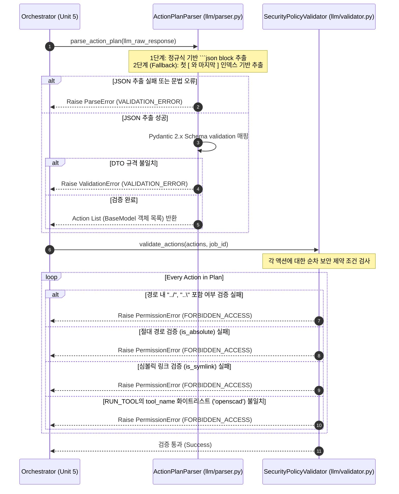

# 비즈니스 논리 모델 (Business Logic Model) - Unit 2: Parser & Policy Validator Service

본 문서는 **Unit 2: Parser & Policy Validator Service**의 핵심 비즈니스 논리인 LLM 마크다운 내 JSON 추출 흐름과 액션 플랜의 보안 유효성 검증 프로세스를 명세합니다.

---

## 1. 액션 플랜 파싱 및 보안 검증 시퀀스 (Sequence Diagram)

LLM이 반환한 응답 텍스트를 정제하고 보안 검증을 통과하기까지의 논리적 흐름입니다.



---

## 2. 세부 비즈니스 프로세스 명세 (Detailed Processes)

### 2.1 마크다운 JSON 추출 프로세스 (`ActionPlanParser.parse_action_plan`)
사용자의 의사결정(질문 2: 옵션 A)에 근거하여 LLM의 가변적인 응답을 유연하게 소화할 수 있는 Fallback 전략 탑재 파서를 설계합니다.

1. **정규식 매칭 (1차 시도)**: 
   - `(?s)```json\s*(.*?)\s*``` ` 패턴을 이용해 Markdown 코드 블록 내의 JSON 텍스트 세그먼트를 추출합니다.
2. **인덱스 파싱 (2차 Fallback 시도)**:
   - 1차 매칭에 실패한 경우, 원문 전체에서 가장 먼저 출현하는 `[` 문자 인덱스와 가장 마지막에 출현하는 `]` 문자 인덱스를 파악합니다.
   - 해당 범위로 문자열을 슬라이싱하여 유효한 JSON 배열 문자열을 재추출합니다.
3. **JSON 역직렬화 및 DTO 매핑**:
   - 추출된 JSON 문자열을 Python 객체로 디코딩하고, Pydantic 모델 리스트로 매핑하여 필드 누락 및 타입 불일치를 검증합니다.

### 2.2 보안 및 안전성 검증 프로세스 (`SecurityPolicyValidator.validate_actions`)
사용자의 의사결정(질문 3, 4: 옵션 A)에 따라 엄격한 화이트리스트 및 절대경로, 심볼릭링크 차단 로직을 실행합니다.

1. **상대경로 내 탐색 기호 검사**:
   - `relative_path` 값이 포함된 모든 액션 객체에 대해, `../` 혹은 `..\\` 패턴이 문자열 내에 존재하는지 검사하여 발견 시 예외를 발생시킵니다.
2. **절대경로 진입 차단 검사**:
   - 경로 문자열이 `/` 혹은 `\\`로 시작하거나 `Path(p).is_absolute()` 가 참인 경우, 호스트 시스템 중요 디렉토리 접근 시도로 간주하고 즉각 예외를 던집니다.
3. **심볼릭 링크 탐색 검사**:
   - 대상 가상 작업 공간 경로 내의 타겟 파일이 물리적으로 이미 존재하고 있는 상황에서, 해당 파일의 속성이 심볼릭 링크(`is_symlink()`)인 경우 비인가 경로 탈출 시도로 판정하고 차단합니다.
4. **허용된 도구 화이트리스트 검사**:
   - `RUN_TOOL` 액션에 명시된 `tool_name`을 강제로 소문자 정규화한 후, 허용된 단일 툴 키워드인 `openscad`와 대조합니다. 불일치 시 예외를 발생시킵니다.
5. **물리 영역 검증 (Path Resolve Bound)**:
   - `.workspaces/jobs/{job_id}` 임시 폴더의 물리 절대 경로를 resolve한 후, 액션의 최종 target path를 resolve한 경로가 이 가운더리에 온전히 안착하는지 `is_relative_to()` 함수로 최종 락(Lock)을 걸어 검증합니다.
