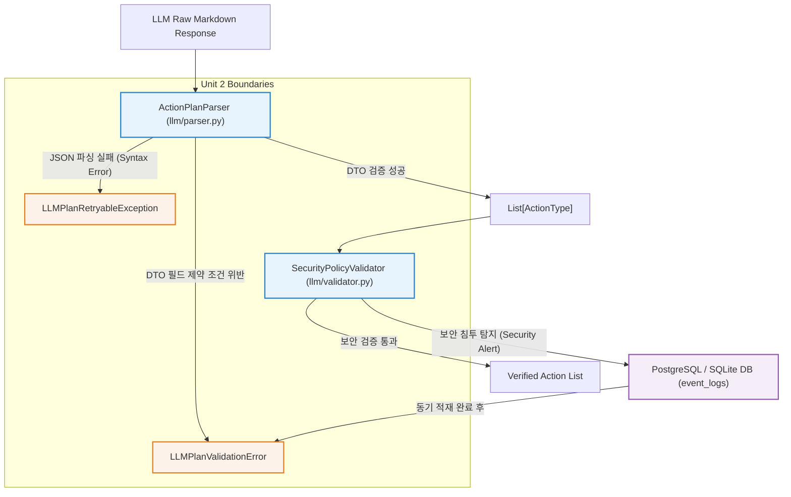

# 논리 아키텍처 컴포넌트 명세 (Logical Components) - Unit 2: Parser & Policy Validator Service

본 문서는 **Unit 2: Parser & Policy Validator Service**를 구성하는 핵심 논리 컴포넌트의 클래스/메서드 인터페이스 사양과 컴포넌트 간 데이터 흐름을 명세합니다.

---

## 1. 컴포넌트 흐름도 (Mermaid Component Diagram)

액션 플랜을 수집하여 검증하고, 예외 및 감사를 처리하는 컴포넌트 간의 상호작용 설계입니다.



---

## 2. 컴포넌트 인터페이스 명세 (Component Interfaces)

### 2.1 `ActionPlanParser` (llm/parser.py)
LLM의 원본 텍스트로부터 액션 목록 객체들을 추출하고 검증하는 파서 클래스입니다.

* **메서드**:
  ```python
  def parse_action_plan(self, text: str) -> List[ActionType]:
      """
      LLM 응답 텍스트를 파싱하여 Pydantic DTO 기반의 검증된 액션 리스트를 반환합니다.
      
      - Parameter:
        - text: LLM API가 출력한 원본 텍스트 (Markdown 포함 가능)
      - Return:
        - Pydantic DTO (ActionType) 인스턴스들의 리스트
      - Exception:
        - LLMPlanRetryableException: JSON 구문 에러로 파싱 불가시 (재시도용)
        - LLMPlanValidationError: 필드 유효성 조건 위반 시 (즉시 실패용)
      """
      pass
  ```

### 2.2 `SecurityPolicyValidator` (llm/validator.py)
파싱된 액션들이 보안 가이드라인 및 화이트리스트 정책을 위반하지 않았는지 정밀 검증하는 감사 클래스입니다.

* **메서드**:
  ```python
  def validate_actions(self, actions: List[ActionType], job_id: uuid.UUID, db: Session) -> None:
      """
      전체 액션 플랜의 보안 제약 사항(Path Traversal, Symlink 우회, 비인가 도구)을 검증합니다.
      위반 발생 시 즉시 DB에 보안 감사 로그를 동기적으로 적재하고 예외를 반환합니다.
      
      - Parameter:
        - actions: 검증 대상 액션 인스턴스 리스트
        - job_id: 실행 대상 Job의 UUID
        - db: 동기식 감사 로그 기록을 수행할 데이터베이스 세션
      - Exception:
        - LLMPlanValidationError: 보안 규칙 위반 감지 시 (Status Code 403 / FORBIDDEN_ACCESS)
      """
      pass
  ```

### 2.3 커스텀 예외 클래스 명세
* **`LLMPlanRetryableException`**:
  - `message`: 에러 개요 메시지 (str)
  - `raw_content`: 파싱에 실패한 LLM 원본 응답 텍스트 (str)
  - `error_position`: 에러 발생 라인 번호 또는 문자 위치 정보 (Optional[str])
* **`LLMPlanValidationError`**:
  - `message`: 구체적인 유효성 및 보안 위반 사유 (str)
  - `status_code`: HTTP 상태 코드 매핑 (int - 400 또는 403)
  - `error_code`: 내부 비즈니스 에러 코드 (str - VALIDATION_ERROR 또는 FORBIDDEN_ACCESS)
