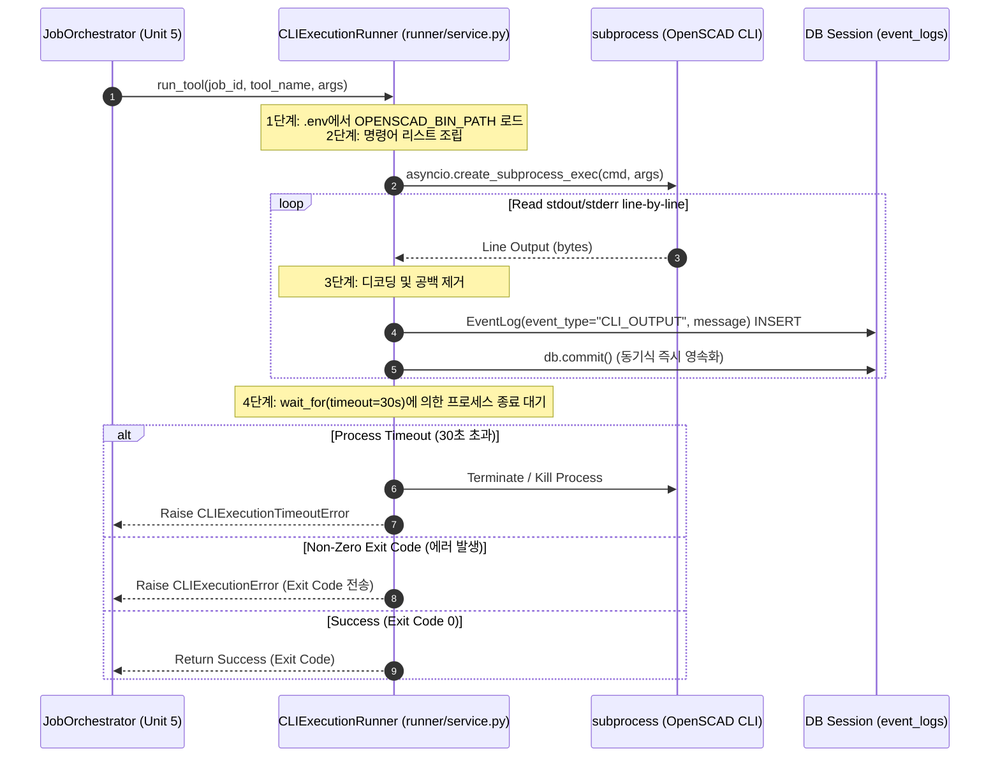

# 비즈니스 논리 모델 (Business Logic Model) - Unit 3: CLI Runner Service

본 문서는 **Unit 3: CLI Runner Service**의 핵심 비즈니스 로직인 OpenSCAD CLI 프로세스 실행 모델 및 리소스 제약 통제 흐름을 정의합니다.

---

## 1. CLI 실행 시퀀스 (Sequence Diagram)

비동기 오케스트레이터가 `CLIExecutionRunner`를 호출하여 OpenSCAD를 가동하고, 실시간 로그를 수집하여 DB에 적재하기까지의 논리적 흐름입니다.

---

## 2. 세부 비즈니스 프로세스 명세 (Detailed Processes)

### 2.1 CLI 환경 및 명령어 매핑
1. **바이너리 경로 분석**:
   - 시스템 환경 변수 및 `.env` 파일로부터 `OPENSCAD_BIN_PATH` 설정을 쿼리합니다.
   - 해당 설정이 누락되었거나 비어 있는 경우, 호스트 PATH에 의존하는 기본값 `"openscad"`를 명령어로 결정합니다. (사용자 결정: 질문 2 - 옵션 B)
2. **명령 아규먼트 조립**:
   - `["openscad"] + args` 형식으로 프로세스 기동 명령어 목록을 구성합니다.
   - 예: `["D:/Program Files/OpenSCAD/openscad.exe", "-o", "preview.png", "model.scad"]`

### 2.2 비동기 스트리밍 출력 수집 (Line-by-Line Log Logging)
사용자의 의사결정(질문 1: 옵션 B)에 근거하여 CLI 구동과 동시에 실시간 로그 적재 및 노출을 지원합니다.
1. **비동기 프로세스 기동**:
   - `asyncio.create_subprocess_exec`를 활용하여 비차단(Non-blocking) 서브프로세스를 생성합니다.
   - 이때 `stdout=asyncio.subprocess.PIPE`, `stderr=asyncio.subprocess.STDOUT`로 병합 설정하여 에러 출력과 표준 출력을 하나의 스트림으로 통합 캡처합니다.
2. **실시간 로그 루프**:
   - 프로세스의 `stdout.readline()` 비동기 대기 스트림을 수행합니다.
   - 한 라인이 반환될 때마다 UTF-8 디코딩 처리 및 개행문자를 제거하고, `event_logs` 테이블에 `event_type="CLI_OUTPUT"` 및 해당 문자열을 `message`로 하는 로그 엔티티를 동기식 데이터베이스 커밋(`db.commit()`)으로 즉각 영속화합니다.

### 2.3 프로세스 타임아웃 및 강제 리소스 클린업
1. **타임아웃 한도 설정**:
   - 악성 루프 모델링 파일 구동에 따른 CPU/메모리 무한 점유를 방지하기 위해 `asyncio.wait_for`를 통해 실행 임계치를 30초로 제한합니다.
2. **비정상 강제 종료**:
   - 30초 초과 시 `asyncio.TimeoutError`를 캐치하고, 실행 중인 서브프로세스에 `.kill()` 혹은 `.terminate()` 신호를 발송하여 잔여 OS 핸들 및 시스템 메모리를 강제 회수합니다.
   - 이후 상위 예외 처리기에 `CLIExecutionTimeoutError`를 전달합니다.

### 2.4 상태 전이 및 예외 전파 위임
사용자의 의사결정(질문 3: 옵션 B)에 따라 CLI Runner 서비스 자체에서 Job 상태를 직업 수정하지 않습니다.
1. **비즈니스 에러 래핑**:
   - 타임아웃 초과 시 `CLIExecutionTimeoutError`, Exit Code가 0이 아닌 경우 `CLIExecutionError(exit_code)` 예외를 각각 생성하여 상위 호출처(오케스트레이터)로 상향 전파(Raise)합니다.
2. **오케스트레이터 관리 위임**:
   - 발생한 비즈니스 에러를 캐치한 상위 오케스트레이터(Unit 5)가 Job 엔티티의 상태를 `FAILED`로 기록하거나 재시도를 수행하도록 처리 책임을 양도합니다.
