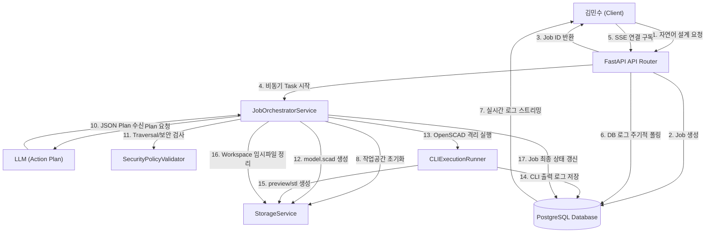

# 애플리케이션 아키텍처 설계 종합서 (Application Architecture Design)

본 문서는 **LLM 기반 Workspace CLI Execution Platform**의 종합 아키텍처 및 상세 컴포넌트 설계를 명세하는 인셉션 산출물입니다.

---

## 1. 아키텍처 설계 원칙 (Architecture Design Principles)

본 시스템은 사용자 답변과 요구사항 명세에 기반하여 다음과 같은 핵심 설계 원칙을 준수합니다.

1. **도메인/기능 중심 구조 (Feature-based Architecture)**: 
   - `jobs`, `llm`, `runner`, `sse`, `storage` 등 비즈니스 도메인 단위로 패키지를 분리하여, 향후 다른 CLI 도구(Mermaid, FFmpeg 등)가 확장될 때 독립적인 도메인 추가만으로도 플랫폼이 유연하게 확장될 수 있도록 합니다.
2. **보안 역할 분리 (Security Separation of Concerns)**:
   - LLM Plan을 처리하는 파트에서 JSON 검증을 전담하는 `ActionPlanParser`와 디렉토리 traversal 방지 및 CLI 인자를 검사하는 `SecurityPolicyValidator`를 분리하여 보안 결함이 발생할 가능성을 최소화합니다.
3. **아티팩트 특화 스토리지 추상화 (Storage Abstraction)**:
   - 파일 I/O뿐만 아니라 아티팩트 보관(`store_job_artifact`)과 작업 디렉토리의 생애주기 관리(`clean_workspace`)가 결합된 `StorageService` 인터페이스를 수립하여, 결합도를 낮추고 추후 AWS S3 등으로의 스토리지 교체를 용이하게 합니다.
4. **YAGNI 기반 비동기 로그 스트리밍 (Direct DB Log Insertion & Polling)**:
   - 복잡한 인메모리 메시지 큐나 Redis Streams 대신, CLI Runner는 모든 로그를 PostgreSQL `event_logs` 테이블에 삽입(INSERT)하고, SSE Connection Manager는 0.5초 주기로 DB를 조회(Polling)하는 방식을 채택합니다. 이는 아키텍처 복잡성을 최소화하면서도 `Last-Event-ID` 기반의 누락 이벤트 복구 요구사항을 안전하게 만족시킵니다.

---

## 2. 핵심 컴포넌트 정의 (Component Definitions)

### 2.1 jobs 도메인 (Job 관리)
#### JobManager
- **목적**: 사용자의 요청을 기반으로 비동기 Job을 등록하고 상태를 추적 및 관리합니다.
- **책임**: 고유 UUID 생성, Job 상태 전이 제어, DB 트랜잭션 처리.

### 2.2 llm 도메인 (LLM 계획 및 보안 검증)
#### ActionPlanParser
- **목적**: LLM의 응답에서 JSON Action Plan을 안전하게 로드하고 스키마를 유효성 검사합니다.
#### SecurityPolicyValidator
- **목적**: 작업 경로에 `../`이 포함되어 있거나 절대 경로, 심볼릭 링크 형태인지를 차단하고 허용된 도구(`openscad`)에 대해서만 명령을 유효화합니다.

### 2.3 runner 도메인 (격리 프로세스 실행)
#### CLIExecutionRunner
- **목적**: 쉘 인젝션이 차단된 구조로 OpenSCAD CLI를 실행하며, 30초 timeout 등의 리소스 제약을 가합니다.

### 2.4 sse 도메인 (이벤트 스트리밍 및 복구)
#### SSEConnectionManager
- **목적**: SSE 클라이언트에 실시간 로그를 스트리밍하고, `Last-Event-ID` 수신 시 DB에서 누락 로그를 복구 조회하여 송신합니다.

### 2.5 storage 도메인 (아티팩트 관리)
#### StorageService (Interface)
- **목적**: Job Workspace의 물리 디렉토리를 생성, 쓰기, 아티팩트 보관, 정리(`clean_workspace`)하는 인터페이스입니다.
#### LocalStorageService (Implementation)
- **목적**: 호스트 파일 시스템을 활용해 `StorageService`를 실제로 구현하는 MVP 클래스입니다.

---

## 3. 컴포넌트 메서드 및 인터페이스 명세 (Methods Specification)

```python
# jobs/service.py
class JobManager:
    async def create_job(self, prompt: str) -> JobSchema: ...
    async def update_job_status(self, job_id: UUID, status: JobStatus, error_message: str = None) -> JobSchema: ...
    async def get_job(self, job_id: UUID) -> JobSchema: ...

# llm/parser.py
class ActionPlanParser:
    def parse_plan(self, llm_raw_response: str) -> List[ActionSchema]: ...

# llm/validator.py
class SecurityPolicyValidator:
    def validate_plan(self, workspace_root: Path, plan: List[ActionSchema]) -> None: ...
    def check_safe_path(self, workspace_root: Path, relative_path: str) -> Path: ...

# runner/executor.py
class CLIExecutionRunner:
    def run_tool(self, workspace_path: Path, tool_name: str, args: List[str], timeout: int = 30) -> CLIResult: ...

# sse/manager.py
class SSEConnectionManager:
    async def write_event_log(self, job_id: UUID, event_type: str, message: str) -> int: ...
    async def stream_logs(self, job_id: UUID, last_event_id: int = None) -> AsyncGenerator[SSEEventSchema, None]: ...

# storage/interface.py
class StorageService(ABC):
    def initialize_workspace(self, job_id: UUID) -> Path: ...
    def store_job_artifact(self, job_id: UUID, file_name: str, content: bytes) -> str: ...
    def clean_workspace(self, job_id: UUID) -> None: ...
```

---

## 4. 서비스 오케스트레이션 (Orchestration Flow)

`JobOrchestratorService`에 의한 Job 실행의 순차 단계입니다.

```
[사용자 요청]
       |
       v
+--------------+     Job 등록      +-------------------+
|  API Router  | --------------> |    JobManager     |
+--------------+                 +-------------------+
       |                                   |
       | 비동기 태스크 위임                 | CREATED 상태 DB 기록
       v                                   v
+-----------------------------+    +-------------------+
|   JobOrchestratorService    |    |   PostgreSQL DB   |
+-----------------------------+    +-------------------+
       |
       |-- 1. Workspace 생성 (initialize_workspace) ---> [StorageService]
       |-- 2. Job 상태 변경 (RUNNING) -----------------> [JobManager]
       |-- 3. 계획 수립 (Action Plan Request) ----------> [LLM API]
       |-- 4. 계획 파싱 (parse_plan) -------------------> [ActionPlanParser]
       |-- 5. 보안 정책 검증 (validate_plan) ------------> [SecurityPolicyValidator]
       |-- 6. 루프 실행 (Actions Execution)
       |    |-- WRITE_FILE / CREATE_DIRECTORY
       |    |-- RUN_TOOL (openscad 30초 한도 실행) ----> [CLIExecutionRunner] (로그 DB 기록)
       |    |-- CREATE_ARTIFACT (영구 저장) -------------> [StorageService] (URL 반환)
       |-- 7. 성공/실패 갱신 (COMPLETED / FAILED) ------> [JobManager]
       |-- 8. Workspace 정리 (clean_workspace) ---------> [StorageService]
```

---

## 5. 의존성 및 데이터 흐름 (Dependencies & Data Flow)

### 5.1 의존성 관계
- **동기 제어 흐름**: `API Router` -> `JobOrchestratorService` (FastAPI Background Task 시작) -> `StorageService`, `ActionPlanParser`, `SecurityPolicyValidator`, `CLIExecutionRunner`.
- **비연결 로그 흐름**: `CLIExecutionRunner`는 실행 로그를 PostgreSQL의 `event_logs` 테이블에 비동기 INSERT하고, `SSEConnectionManager`는 이 테이블을 폴링하여 클라이언트에 스트리밍함으로써 러너와 SSE 간의 커플링(의존성)을 제거합니다.

### 5.2 데이터 흐름 (Mermaid Flowchart)


