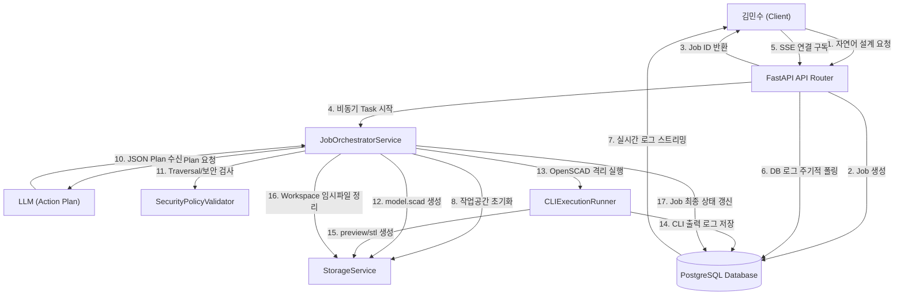

# 컴포넌트 의존성 정의서 (Component Dependencies & Data Flow)

본 문서는 **LLM 기반 Workspace CLI Execution Platform**의 컴포넌트 간 의존성 구조, 결합 수준, 통신 패턴 및 데이터 흐름을 명세합니다.

---

## 1. 의존성 매트릭스 (Dependency Matrix)

| 호출 컴포넌트 (Caller) | 피호출 컴포넌트 (Callee) | 의존성 유형 (Dependency Type) | 설명 |
| :--- | :--- | :--- | :--- |
| **API Router** | **JobManager** | 동기 (Direct Call) | Job 정보 생성 및 조회 |
| **API Router** | **SSEConnectionManager** | 비동기 스트림 (SSE Generator) | 클라이언트 SSE 스트림 연결 매핑 |
| **API Router** | **JobOrchestratorService** | 비동기 (Background Task) | 비동기 설계 실행 라이프사이클 격리 구동 |
| **JobOrchestratorService** | **StorageService** | 동기 (Interface Call) | Workspace 생성/정리 및 파일 I/O 제어 |
| **JobOrchestratorService** | **ActionPlanParser** | 동기 (Utility Call) | LLM JSON 응답 구문 해석 |
| **JobOrchestratorService** | **SecurityPolicyValidator** | 동기 (Policy Check) | Action Plan의 경로 Traversal 방지 검증 |
| **JobOrchestratorService** | **CLIExecutionRunner** | 동기 (Process Spawn) | OpenSCAD CLI 로컬 프로세스 실행 |
| **JobOrchestratorService** | **JobManager** | 동기 (Direct Call) | Job 상태 전이 기록 |
| **SSEConnectionManager** | **PostgreSQL Database** | 폴링 (SQL Query) | 0.5초 주기 `event_logs` 테이블 폴링 |

---

## 2. 통신 패턴 (Communication Patterns)

### 2.1 API 요청 및 백그라운드 오케스트레이션 (HTTP to Background Task)
- 사용자의 REST API 요청은 동기적으로 응답(Job ID 리턴)하되, 실제 무거운 설계 작업 및 CLI 실행은 FastAPI의 `BackgroundTasks`를 통해 별도의 스레드/태스크 컨텍스트로 격리되어 비동기적으로 수행됩니다.

### 2.2 실시간 로그 스트리밍 (SSE & Database Polling)
- **느슨한 결합 (Loose Coupling)**: `CLIExecutionRunner`와 `SSEConnectionManager`는 직접 메모리나 소켓으로 통신하지 않고, **PostgreSQL 데이터베이스 테이블(`event_logs`)**을 통해 느슨하게 연결됩니다.
- **동작**: Runner는 로그 발생 시 데이터베이스에 저장(INSERT)만 하고, SSE 스트림 핸들러는 데이터베이스를 주기적(0.5초)으로 쿼리하여 전송하므로 양 컴포넌트 간의 직접적인 의존성 결합이 제거(YAGNI & 단순화 보장)됩니다.

---

## 3. 데이터 흐름 다이어그램 (Data Flow Diagram)

### 3.1 Mermaid 데이터 흐름도

### 3.2 텍스트 대체 데이터 흐름 설명
1. **요청 접수**: 사용자가 API Router에 요청을 보내면 즉시 Job ID가 DB에 생성 및 사용자에게 응답되고 백그라운드 태스크가 실행됩니다.
2. **SSE 연결**: 사용자는 응답받은 Job ID로 SSE 스트림을 구독하고, SSE 매니저는 0.5초 간격으로 DB 로그 테이블을 폴링하여 대기합니다.
3. **LLM 계획 수립 및 검증**: 백그라운드 태스크는 Workspace를 초기화하고 LLM에게 Action Plan을 받아와 `SecurityPolicyValidator`로 경로 traversal 여부를 엄격히 검증합니다.
4. **CLI 실행 및 로깅**: 검증된 plan에 따라 파일이 생성되고, `CLIExecutionRunner`가 OpenSCAD를 로컬 격리 실행합니다. 이때 발생하는 모든 로그는 즉시 DB에 기록되어 SSE 스트림으로 클라이언트에게 실시간 중계됩니다.
5. **완료 및 다운로드**: 실행이 완료되면 최종 산출물(stl, png)이 영구 저장소에 배치되고, Workspace 임시파일이 Clean-up 되며 다운로드 링크가 제공됩니다.
