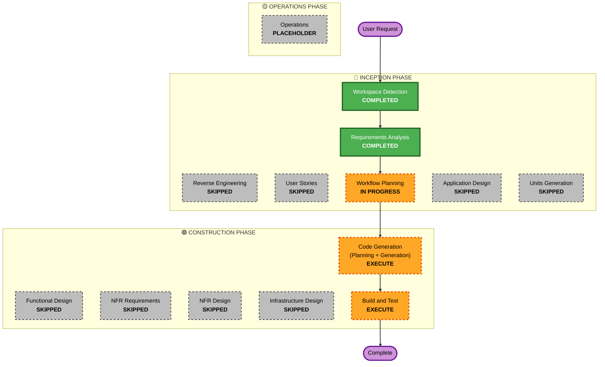

# Execution Plan - HOTFIX R-17-LOGGING (아티팩트 생명주기 로깅 및 경로 검증 개선)

본 문서는 Mac Docker UI 및 로컬 개발 환경에서의 아티팩트 다운로드 실패 원인을 진단하고, 아티팩트 생명주기를 완벽히 추적할 수 있도록 11가지의 상세 이벤트 로그 마커를 보강하기 위한 핫픽스 실행 계획을 정의합니다.

## Detailed Analysis Summary

### Transformation Scope (Brownfield Only)
- **Transformation Type**: Bug Fix / Diagnostic Enhancement (로깅 강화 및 경로 검증 디버그 정보 보강)
- **Primary Changes**: 
  - `storage/local.py`의 `_validate_safe_path`와 `check_artifact_exists`에 11가지 라이프사이클 마커 로깅 및 경로 검증 실패 상세 디버깅 경고 로그 주입.
  - `jobs/service.py`의 `ArtifactService.get_artifact_for_download`와 `register_artifact`에 로깅 마커 적용 및 `ValueError` / `is_relative_to` 실패 시 상세 경로 정보(`target_path`, `base_job_dir`)를 포함한 디버그 로깅 적용.
  - `jobs/router.py` 내의 다운로드 엔드포인트에 진입(`ARTIFACT_DOWNLOAD_REQUESTED`) 및 완료(`ARTIFACT_DOWNLOAD_READY`) 마커 적용.
  - `runner/service.py` 내 CLI 실행 후 파일 생성 및 이관 완료 시점에 `ARTIFACT_GENERATION_COMPLETED` 마커 적용.
  - 호스트 절대 서버 경로가 외부 에러 본문으로 유출되지 않도록 기존 보안 수칙 완벽 유지.
- **Related Components**: `storage/local.py`, `jobs/service.py`, `jobs/router.py`, `runner/service.py`

### Change Impact Assessment
- **User-facing changes**: No — 단, 다운로드 실패 시 백엔드 컨테이너의 콘솔 로그 상에서 실패 원인(경로 검증 실패인지, 물리 파일 누락인지 등)과 실제 분석된 경로 데이터를 실시간으로 파악 가능하게 되어 디버깅 사용성이 극대화됩니다.
- **Structural changes**: No — 로깅 및 예외 발생 시의 세부 정보 수집 코드만 안전하게 보강됩니다.
- **Data model changes**: No
- **API changes**: No
- **NFR impact**: Yes — 다운로드 기능의 관측성(Observability) 및 개발 운영 유지보수성이 향상됩니다.

### Risk Assessment
- **Risk Level**: Low — 단순 로깅 추가 및 경로 resolve 과정의 디버그 프린트 수준이므로 시스템에 악영향을 주지 않고 안전합니다.
- **Rollback Complexity**: Easy
- **Testing Complexity**: Simple

---

## Workflow Visualization

### Mermaid Diagram


### Text Alternative
```
Phase 1: INCEPTION
- Workspace Detection (COMPLETED)
- Reverse Engineering (SKIPPED)
- Requirements Analysis (COMPLETED)
- User Stories (SKIPPED)
- Workflow Planning (IN PROGRESS)
- Application Design (SKIPPED)
- Units Generation (SKIPPED)

Phase 2: CONSTRUCTION
- Functional Design (SKIPPED)
- NFR Requirements (SKIPPED)
- NFR Design (SKIPPED)
- Infrastructure Design (SKIPPED)
- Code Generation (EXECUTE)
- Build and Test (EXECUTE)

Phase 3: OPERATIONS
- Operations (PLACEHOLDER)
```

---

## Phases to Execute

### 🔵 INCEPTION PHASE
- [x] Workspace Detection (COMPLETED)
- [x] Reverse Engineering (SKIPPED)
  - **Rationale**: 기존 역공학 산출물이 유효하며 로깅 보강에 따른 설계 구조 변동이 극히 적어 생략합니다.
- [x] Requirements Analysis (COMPLETED)
- [ ] Workflow Planning (IN PROGRESS)
- [ ] Application Design - **SKIP**
  - **Rationale**: 기존 모듈 아키텍처를 그대로 따르며 추가적인 컴포넌트 생성이 불필요합니다.
- [ ] Units Generation - **SKIP**
  - **Rationale**: 단일 핫픽스 범위로 작업 유닛 분할이 불필요합니다.

### 🟢 CONSTRUCTION PHASE
- [ ] Functional Design - **SKIP**
  - **Rationale**: 데이터 스키마 및 비즈니스 전이 규칙의 설계 변동이 없으므로 생략합니다.
- [ ] NFR Requirements - **SKIP**
  - **Rationale**: 신규 비기능 요건의 수립이 불필요합니다.
- [ ] NFR Design - **SKIP**
  - **Rationale**: 기존 보안/성능 설계 패턴을 그대로 적용하므로 생략합니다.
- [ ] Infrastructure Design - **SKIP**
  - **Rationale**: 배포 및 마운트 인프라 환경의 변경이 없으므로 생략합니다.
- [ ] Code Generation - **EXECUTE**
  - **Rationale**: 11가지 로깅 마커 삽입 및 상세 경로 예외 추적 로그를 구현합니다.
- [ ] Build and Test - **EXECUTE**
  - **Rationale**: 기존 95개 회귀 테스트 성공 확인 및 로깅 마커 유효성 검증을 수행합니다.

### 🟡 OPERATIONS PHASE
- [ ] Operations - **SKIP** (PLACEHOLDER)

---

## Requirement Verification Plan

| Requirement/Story | Acceptance Criteria or Contract | Required Test Evidence | Test Level | Planned Test File or Scenario | Required Result |
| --- | --- | --- | --- | --- | --- |
| R-17-LOGGING | 11개 로그 마커 출력 | 테스트 수행 시 콘솔 로그 내 `[MARKER]` 정상 발행 확인 | unit/integration | `tests/test_unit_2.py` 내 다운로드 및 복사 테스트 케이스 | Pass |
| R-17-LOGGING | 경로 검증 실패 시 상세 로그 및 호스트 노출 차단 | 경로 위반 테스트 실행 시 `[ARTIFACT_DOWNLOAD_PATH_VALIDATION_FAILED]` 마커 및 target_path, base_job_dir이 서버 로그에만 로깅되고, HTTP 에러 본문에는 절대 서버 경로가 없음 검증 | unit/integration/security | `tests/test_unit_2.py` 내 traversal 및 prefix-bypass 거부 테스트 케이스 | Pass |
| 회귀 방지 | 기존 95개 테스트 유지 | `pytest`를 통한 95개 전체 테스트 스위트의 성공 통과 | unit/integration | 전체 테스트 스위트 | Pass |

---

## Estimated Timeline
- **Total Phases**: Inception (Workflow Planning) & Construction (Code Generation, Build and Test)
- **Estimated Duration**: 30 minutes (로깅 코드 구현 및 로컬 회귀 테스트 완료 기준)

## Success Criteria
- **Primary Goal**: 아티팩트 라이프사이클의 11가지 로깅 마커 주입 및 디버깅을 위한 경로 상세 로깅 보강 완료.
- **Key Deliverables**: 
  - `storage/local.py` (마커 로깅 및 경로 검증 경고 추가)
  - `jobs/service.py` (ArtifactService 마커 로깅 및 경로 예외 로깅 추가)
  - `jobs/router.py` (라우터 단 마커 로깅 추가)
  - `runner/service.py` (생성 완료 마커 로깅 추가)
  - `tests/test_unit_2.py` / `tests/test_unit_3.py` (로깅 정상 출력 여부 및 회귀 차단 검증)
- **Quality Gates**: 기존 95개 테스트 케이스의 100% Pass 완료.
