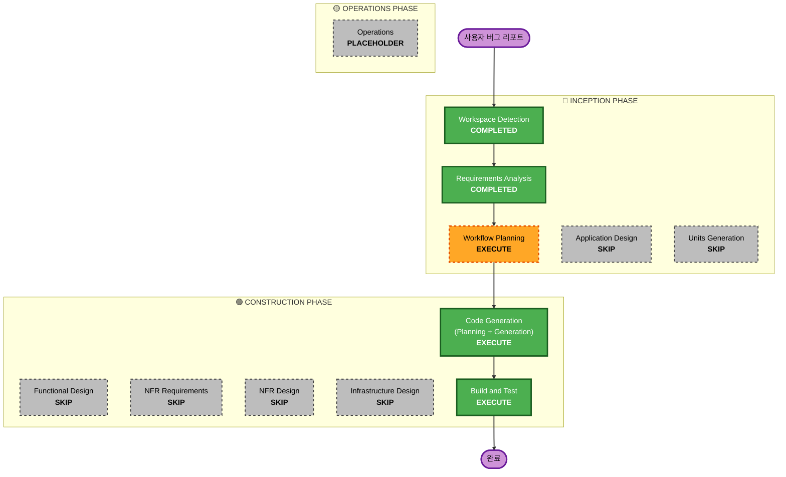

# 실행 계획서 (Execution Plan) - Hotfix (Timezone & OpenAI Client)

본 문서는 로컬 데이터베이스의 한국 표준시(KST) 타임존 설정(R-8) 및 OpenAI 호환 Chat Completions API 페이로드 지원(R-9)을 위한 핫픽스 실행 계획을 기술합니다.

## 1. 상세 분석 요약 (Detailed Analysis Summary)

### 변환 범위 (Transformation Scope)
- **변환 유형**: 애플리케이션 컴포넌트 수정 (`database.py`, `llm/client.py`)
- **주요 변경 사항**:
  - `database.py`에서 PostgreSQL 데이터베이스 연결 시 세션 타임존 파라미터(`connect_args`) 적용.
  - `llm/client.py`에서 `LLM_ENDPOINT`에 `chat/completions`가 포함된 경우 표준 OpenAI 형식의 `messages` 배열을 사용하여 요청을 구성하고, 응답 데이터에서 `choices` 구조를 올바르게 파싱하도록 처리.
- **관련 컴포넌트**: `database.py` (DB 커넥션 설정), `llm/client.py` (LLM API 호출 모듈)

### 변경 영향 평가 (Change Impact Assessment)
- **사용자 제공 변경사항**: 없음 (UI 영향 없음)
- **구조적 변경**: 없음
- **데이터 모델 변경**: 없음 (저장 및 조회되는 시간의 Offset 정보가 KST로 변경됨)
- **API 변경**: 없음 (응답 Schema는 동일하되, 시간 포맷이 KST로 직렬화됨)
- **NFR 영향**: 로컬 환경 가용성 및 외부 LLM 연동 신뢰성 향상

### 컴포넌트 관계 (Component Relationships)
```markdown
## Component Relationships
- **Primary Component**: database.py (DB Connection), llm/client.py (HttpLLMClient)
- **Shared Components**: jobs/models.py, jobs/schemas.py (상태 및 직렬화 규칙 공유)
- **Dependent Components**: orchestrator/service.py (LLM Client 호출 및 데이터베이스 트랜잭션 의존)
```

### 위험 평가 (Risk Assessment)
- **위험 수준**: 낮음 (Low)
- **롤백 복잡도**: 쉬움 (Git Commit 롤백 가능)
- **테스트 복잡도**: 단순 (단위 테스트 추가 및 전체 테스트 회귀 확인)

---

## 2. 워크플로우 시각화 (Workflow Visualization)



---

## 3. 실행 및 제외 단계 (Phases to Execute & Skip)

### 🔵 INCEPTION PHASE
- [x] Workspace Detection (COMPLETED)
- [x] Requirements Analysis (COMPLETED)
- [x] Execution Plan (IN PROGRESS)
- [ ] Application Design - SKIP
  - **이유**: 신규 논리 컴포넌트나 서비스 인터페이스 추가 없이 기존 컴포넌트의 내부 동작만 개선하므로 설계 단계 불필요.
- [ ] Units Generation - SKIP
  - **이유**: 단일 작업 단위(핫픽스)로 병합 처리가 가능하여 다중 유닛 분할 불필요.

### 🟢 CONSTRUCTION PHASE
- [ ] Functional Design - SKIP
  - **이유**: 타임존 파라미터 및 OpenAI API 구조라는 명확한 구현 세부 기술 스택으로 한정되어 상세 비즈니스 규칙 재설계 불필요.
- [ ] NFR Requirements - SKIP
  - **이유**: 기존 NFR 범위 내에 포함되며 새로운 신뢰성/보안 정책 정의 불필요.
- [ ] NFR Design - SKIP
  - **이유**: 새로운 NFR 구조적 패턴 도입 불필요.
- [ ] Infrastructure Design - SKIP
  - **이유**: 인프라 리소스 변경 없음.
- [ ] Code Generation - EXECUTE (ALWAYS)
  - **이유**: `database.py` 및 `llm/client.py` 코드 생성 및 `tests/test_unit_5.py` 테스트 케이스 작성을 위함.
- [ ] Build and Test - EXECUTE (ALWAYS)
  - **이유**: 신규 작성된 테스트 및 기존 45개 전체 테스트 시나리오가 모두 정상 작동하는지 회귀 검증을 수행하기 위함.

### 🟡 OPERATIONS PHASE
- [ ] Operations - PLACEHOLDER
  - **이유**: MVP 아키텍처에 따른 기본 흐름 유지.

---

## 4. 요구사항 검증 계획 (Requirement Verification Plan)

| 요구사항/스토리 | 인수 조건 및 명세 | 필요한 테스트 증거 | 테스트 레벨 | 예정된 테스트 시나리오 | 검증 결과 |
| --- | --- | --- | --- | --- | --- |
| R-8 | PostgreSQL 접속 시 KST 타임존 세션 옵션 적용, SQLite 접속 시 제외 | 에러 없이 실행 및 DB 세션 유지 | unit/integration | `database.py` 수동 검증 및 기존 SQLite 테스트 통과 | Pass |
| R-9 | `chat/completions` endpoint 호출 시 OpenAI 형식 변환 및 응답 파싱 | `choices` 및 `messages` 검증 | unit | `tests/test_unit_5.py` 에 `test_llm_client_openai_format` 추가 | Pass |

---

## 5. 예상 일정 및 마일스톤

- **총 단계**: 3개 단계 (Workflow Planning, Code Generation, Build and Test)
- **예상 소요 시간**: 약 10분
