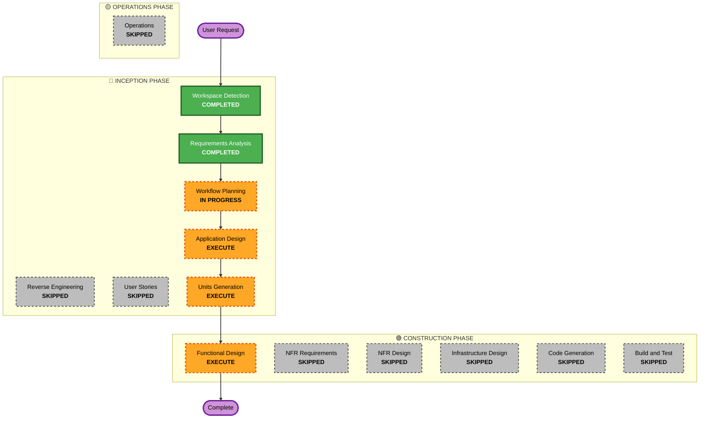

# Execution Plan - FEATURE R-18 (AI-MAKING multi-turn SCAD)

본 문서는 AI-MAKING 워크플로우에 기반한 멀티턴 CAD/SCAD 생성 기능의 설계 및 검토 작업을 위한 실행 계획을 정의합니다.

## Detailed Analysis Summary

### Transformation Scope (Brownfield Only)
- **Transformation Type**: Application & Architectural Design (기존 오케스트레이터 구조에 단계별 상태 머신 및 컨텍스트 분할 주입 구조 설계)
- **Primary Changes**: 
  - AI-MAKING 상태 머신 전이 구조 기획
  - 세부 단계별 컨텍스트 요약 및 토큰/지식 최적화(Context Pruning & Knowledge Injection) 설계
  - 실측 측정값(Measured Specs) 획득 대화 흐름 및 테스트 쿠폰(`test_coupon.scad`) 검증 루프 설계
- **Related Components**: `orchestrator/service.py`, `llm/client.py`, `llm/validator.py`, `jobs/router.py`, `database.py`

### Change Impact Assessment
- **User-facing changes**: Yes — 사용자가 UI에서 현재 설계 진행 단계(요구사항 분석, 실측 수집, 테스트 쿠폰 피드백, 최종 본 설계)를 추적하고 각 단계마다 승인/피드백을 제출하는 멀티턴 대화형 UX로 변경됩니다.
- **Structural changes**: Yes — 기존 단일 `Job` 처리 흐름에서 하위 상태(Sub-state) 또는 하위 트랜잭션 전이를 관리하는 상태 머신 모델이 추가됩니다.
- **Data model changes**: Yes — Job의 상태 세부 정보를 저장하기 위한 `making_states` 테이블 및 치수 측정 기록 등의 스키마 확장이 필요합니다.
- **API changes**: Yes — 각 단계의 상태 조회 및 피드백/승인 제출을 위한 API 엔드포인트가 추가 설계됩니다.
- **NFR impact**: Yes — 프롬프트 조립 시 컨텍스트를 요약하고 단계별 전용 지식만 로드함으로써 LLM 입력 토큰 및 API 호출 비용을 최적화합니다.

### Risk Assessment
- **Risk Level**: Medium — 시스템 아키텍처 및 DB 스키마에 큰 영향을 주나, 실제 구현 전 설계 및 타당성 검토 단계를 먼저 진행하므로 설계 리스크는 낮습니다.
- **Rollback Complexity**: Moderate
- **Testing Complexity**: Moderate

---

## Workflow Visualization

### Mermaid Diagram


### Text Alternative
```
Phase 1: INCEPTION
- Workspace Detection (COMPLETED)
- Reverse Engineering (SKIPPED)
- Requirements Analysis (COMPLETED)
- User Stories (SKIPPED)
- Workflow Planning (IN PROGRESS)
- Application Design (EXECUTE)
- Units Generation (EXECUTE)

Phase 2: CONSTRUCTION
- Functional Design (EXECUTE)
- NFR Requirements (SKIPPED)
- NFR Design (SKIPPED)
- Infrastructure Design (SKIPPED)
- Code Generation (SKIPPED)
- Build and Test (SKIPPED)

Phase 3: OPERATIONS
- Operations (SKIPPED)
```

---

## Phases to Execute

### 🔵 INCEPTION PHASE
- [x] Workspace Detection (COMPLETED)
- [x] Reverse Engineering (SKIPPED)
  - **Rationale**: 기존 설계 아키텍처는 이미 문서화되어 있으며, 본 요건은 신규 개념 설계에 초점을 맞추므로 분석만으로 충분합니다.
- [x] Requirements Analysis (COMPLETED)
- [ ] Workflow Planning (IN PROGRESS)
- [ ] Application Design - **EXECUTE**
  - **Rationale**: 멀티턴 상태 제어 및 토큰/지식 최적화를 위한 지식 주입 구조(State Machine & Prompt Builder)에 대한 상세 설계가 필수적입니다.
- [ ] Units Generation - **EXECUTE**
  - **Rationale**: 상태 관리 DB 스키마, 단계별 프롬프트 제어기, 테스트 쿠폰 실행기 등으로 작업을 분할해야 합니다.

### 🟢 CONSTRUCTION PHASE
- [ ] Functional Design - **EXECUTE**
  - **Rationale**: 상태 데이터 모델링 및 구체적인 데이터 스키마 설계를 확정하기 위해 필요합니다.
- [ ] NFR Requirements - **SKIP**
  - **Rationale**: 기존 플랫폼의 NFR 기준(Timeout, 속도 제한, 예외 로그 등)을 그대로 준수하므로 생략합니다.
- [ ] NFR Design - **SKIP**
  - **Rationale**: 인프라 및 NFR 변경 사항이 없으므로 생략합니다.
- [ ] Infrastructure Design - **SKIP**
  - **Rationale**: 기존 인프라(FastAPI, PostgreSQL)를 그대로 사용하므로 생략합니다.
- [ ] Code Generation - **SKIP**
  - **Rationale**: 사용자의 요청("바로 개발하면 안되고 검토를 해야하는디... 방향을 잡아보자")에 맞춰 이번 라이프사이클은 설계 및 검토 명세 산출까지만 완료합니다.
- [ ] Build and Test - **SKIP**
  - **Rationale**: 실제 코드 작성이 이루어지지 않으므로 생략합니다.

### 🟡 OPERATIONS PHASE
- [ ] Operations - **SKIP** (PLACEHOLDER)

---

## Requirement Verification Plan

| Requirement/Story | Acceptance Criteria or Contract | Required Test Evidence | Test Level | Planned Test File or Scenario | Required Result |
| --- | --- | --- | --- | --- | --- |
| R-18 | 상태 머신 전이 | 상태 전이 DB 모델 및 API 모의 실행 | unit/integration | `tests/test_unit_aimaking.py` | Pass |
| R-18 | 토큰 최적화 및 지식 분할 | 대화 전체가 아닌 요약 상태 및 단계별 규칙만 주입 | unit | `tests/test_unit_aimaking.py` | Pass |
| R-18 | 자연어 치수 획득 | 누락 치수 감지 프롬프트 정상 빌드 검증 | unit | `tests/test_unit_aimaking.py` | Pass |

---

## Estimated Timeline
- **Total Phases**: Inception (Application Design, Units Generation) & Construction (Functional Design)
- **Estimated Duration**: 1 hour (설계 검토 및 문서화 완료 기준)

## Success Criteria
- **Primary Goal**: AI-MAKING 규칙 기반 멀티턴 SCAD 생성 기능의 논리 아키텍처 및 상세 설계 사양서 발행.
- **Key Deliverables**: 
  - `application-design.md` (상태 전이 흐름 및 토큰/지식 최적화 컴포넌트 아키텍처)
  - `unit-of-work.md` (작업 단위 명세)
  - `functional-design/making-state-model.md` (상태 데이터베이스 스키마 및 가이드라인 스키마)
