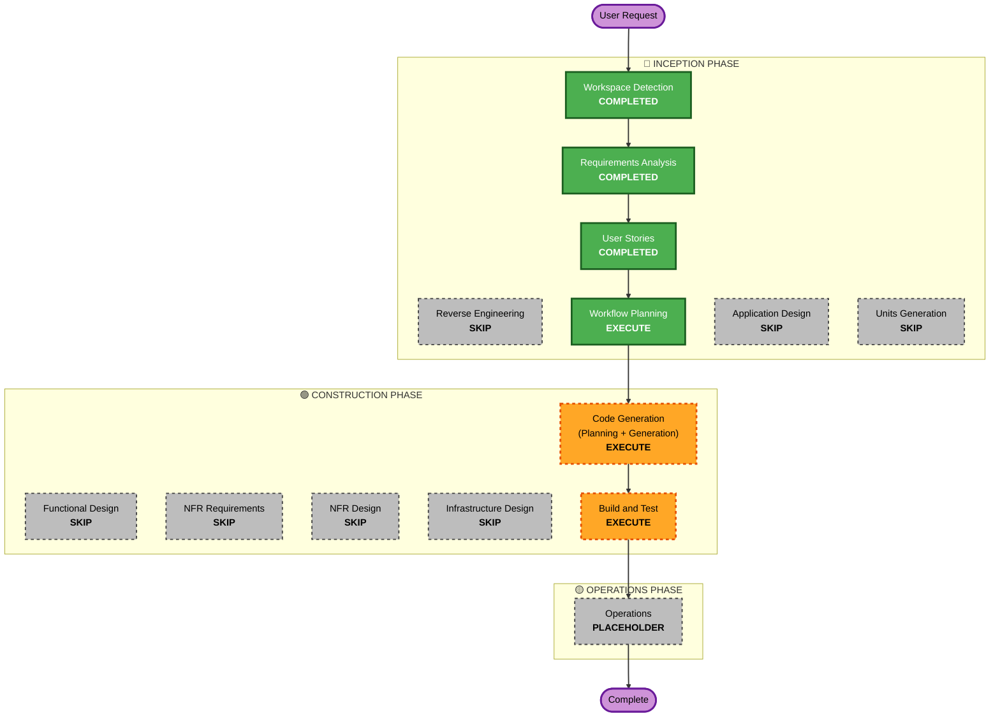

# Execution Plan - R-16

## Detailed Analysis Summary

### Transformation Scope (Brownfield Only)
- **Transformation Type**: Single component (FastAPI Endpoint + Security Validation helper in Service Layer)
- **Primary Changes**: 
  - GET `/api/v1/artifacts/{artifact_id}/download` API 엔드포인트 추가.
  - `ArtifactService` (또는 기존 저장소/서비스 레이어) 내에 파일 경로의 상호 독립적인 등록 시/다운로드 시 물리 경로 검증 구현.
  - `Path.resolve()` 및 `Path.is_relative_to()` (또는 안전한 헬퍼) 기반의 샌드박스 탈출 방어 구현.
- **Related Components**:
  - `storage/local.py` 또는 `storage/service.py` (경로 검증 로직 및 DB 연동)
  - `main.py` (라우터 설정 및 엔드포인트 바인딩)
  - `tests/test_unit_2.py` (혹은 전용 테스트 모듈 구축)

### Change Impact Assessment
- **User-facing changes**: Yes - 사용자가 발급받은 `artifact_id`를 사용하여 직접 브라우저나 클라이언트를 통해 생성 결과물을 다운로드할 수 있는 신규 API 엔드포인트가 제공됩니다.
- **Structural changes**: No - 기존 도메인 레이어 및 스토리지 인프라를 그대로 사용합니다.
- **Data model changes**: No/Minimal - 기존 Artifact 엔티티 또는 마이그레이션이 필요하다면 기존 구조에 맞춰 소폭 적용합니다.
- **API changes**: Yes - `GET /api/v1/artifacts/{artifact_id}/download` 엔드포인트 추가.
- **NFR impact**: Yes - Path Traversal, Absolute Path, Prefix-Bypass 공격에 대한 방어 로직이 적용되어 보안성이 크게 향상됩니다.

### Risk Assessment
- **Risk Level**: Low - 기존 로직을 수정하는 것이 아니라 새로운 다운로드 인터페이스를 추가하고 그 안에 엄격한 경로 검증을 구현하는 것이므로 안전합니다.
- **Rollback Complexity**: Easy - API 엔드포인트를 롤백하거나 제거하는 것으로 간단히 원복 가능합니다.
- **Testing Complexity**: Moderate - 각종 경로 공격 시나리오(traversal, absolute, prefix-bypass) 및 403/404 리턴 경계를 정확히 테스트 스위트로 모의해야 합니다.

## Workflow Visualization



### Text Alternative (항상 포함)
```
User Request 
  --> INCEPTION: Workspace Detection (COMPLETED)
  --> INCEPTION: Requirements Analysis (COMPLETED)
  --> INCEPTION: User Stories (COMPLETED)
  --> INCEPTION: Workflow Planning (EXECUTE)
  --> CONSTRUCTION: Code Generation (Planning + Generation) (EXECUTE)
  --> CONSTRUCTION: Build and Test (EXECUTE)
  --> OPERATIONS: Operations (PLACEHOLDER)
  --> Complete
```

---

## Phases to Execute

### 🔵 INCEPTION PHASE
- [x] Workspace Detection (COMPLETED)
- [x] Reverse Engineering (SKIPPED - Rationale: 기존 문서 및 구조 유효)
- [x] Requirements Analysis (COMPLETED)
- [x] User Stories (COMPLETED)
- [x] Workflow Planning (IN PROGRESS)
- [ ] Application Design (SKIPPED - Rationale: 기존 아키텍처 및 모듈 경계가 명확하므로 신규 설계 불필요)
- [ ] Units Generation (SKIPPED - Rationale: R-16 단일 유닛의 소규모 변경이므로 분해 불필요)

### 🟢 CONSTRUCTION PHASE
- [ ] Functional Design (SKIPPED - Rationale: 요구사항 및 사용자 스토리 분석 과정에서 비즈니스 규칙이 완결되어 반영됨)
- [ ] NFR Requirements (SKIPPED - Rationale: 기존 프로젝트의 보안/성능 인프라 규칙을 그대로 따르며 추가 요구사항이 요구사항 정의서에 내재화됨)
- [ ] NFR Design (SKIPPED - Rationale: 요구사항 단계의 물리 경로 검증 규칙 및 오류 통제 방안이 충분히 구체화됨)
- [ ] Infrastructure Design (SKIPPED - Rationale: 신규 인프라 배포 리소스 추가 없음)
- [ ] Code Generation - EXECUTE (ALWAYS)
  - **Rationale**: 아티팩트 메타데이터 등록 검증, 다운로드 물리 경로 재검증, API 라우터 구현 및 예외 처리 로직 작성이 필요합니다.
- [ ] Build and Test - EXECUTE (ALWAYS)
  - **Rationale**: 정상 케이스 및 403, 404 시나리오(traversal, absolute, prefix-bypass), 회귀 테스트를 수행해야 합니다.

### 🟡 OPERATIONS PHASE
- [ ] Operations - PLACEHOLDER
  - **Rationale**: 배포 및 모니터링 변경 사항 없음.

---

## Package Change Sequence (Brownfield Only)
1. **Database & Storage Core Module**: Artifact 등록 시 상대경로 검증 로직 구현.
2. **Artifact Service Layer**: Artifact ID 기반 조회 및 `Path.resolve()` / `Path.is_relative_to()` 물리 경로 검증 로직 구현.
3. **API Router (`main.py` 등)**: `GET /api/v1/artifacts/{artifact_id}/download` 구현 및 403/404 예외 처리.
4. **Test Suite (`tests/` 등)**: 정상 등록, 다운로드 및 각종 비정상 침입 시도(403/404)에 대한 테스트 케이스 추가.

---

## Estimated Timeline
- **Total Phases**: 3 Stages (Workflow Planning, Code Generation, Build and Test)
- **Estimated Duration**: 약 1시간

---

## Success Criteria
- **Primary Goal**: `GET /api/v1/artifacts/{artifact_id}/download` 엔드포인트를 통해 클라이언트 측 경로 제공 없이 안전하게 아티팩트를 다운로드할 수 있다.
- **Key Deliverables**:
  - `storage` 혹은 `services` 모듈 내 경로 검증 로직 및 DB 연계.
  - API 라우터 다운로드 엔드포인트 구현.
  - 보안 다운로드 통합 테스트 및 단위 테스트.
- **Quality Gates**:
  - 모든 보안 침입 시도(`../` traversal, 절대경로, prefix-bypass)에 대해 HTTP 403 응답이 발생할 것.
  - 존재하지 않는 ID, 파일 누락, 디렉터리 등의 경우 HTTP 404 응답이 발생할 것.
  - 에러 메시지에 절대 경로 노출이 없을 것.
  - 기존 79개 테스트를 포함한 전체 회귀 테스트 통과.

## Requirement Verification Plan

| Requirement/Story | Acceptance Criteria or Contract | Required Test Evidence | Test Level | Planned Test File or Scenario | Required Result |
| --- | --- | --- | --- | --- | --- |
| R-16 / S-8 | 정상 다운로드 성공 | HTTP 200, 올바른 파일 바이트, content_type, filename 헤더 검증 | integration | `tests/test_unit_2.py` | Pass |
| R-16 / S-8 | 정상 상대경로 등록 및 비정상 상대경로 거부 | 절대경로, 빈 경로, `.`, `..`, `../` segment 포함 경로에 대한 거부 단위 테스트 | unit | `tests/test_unit_2.py` | Pass |
| R-16 / S-8 | 알 수 없는 artifact_id | HTTP 404 반환 | integration | `tests/test_unit_2.py` | Pass |
| R-16 / S-8 | 메타데이터 존재하나 물리 파일 누락 | HTTP 404 반환 | integration | `tests/test_unit_2.py` | Pass |
| R-16 / S-8 | 물리 파일이 디렉터리 등 일반 파일 아님 | HTTP 404 반환 | integration | `tests/test_unit_2.py` | Pass |
| R-16 / S-8 | 상위 디렉터리 탈출 (`../` traversal) | HTTP 403 반환 | integration/security | `tests/test_unit_2.py` | Pass |
| R-16 / S-8 | 절대경로 접근 시도 | HTTP 403 반환 | integration/security | `tests/test_unit_2.py` | Pass |
| R-16 / S-8 | 공통 접두사 우회 (prefix-bypass) | HTTP 403 반환 | integration/security | `tests/test_unit_2.py` | Pass |
| R-16 / S-8 | 실패 응답의 절대 서버 경로 누출 차단 | 응답 본문 및 상세 오류 메시지에 절대 서버 경로 없음 검증 | integration/security | `tests/test_unit_2.py` | Pass |
| 회귀 테스트 | 기존 79개 테스트 기능 유지 | pytest 실행 | regression | 전체 테스트 | Pass |
