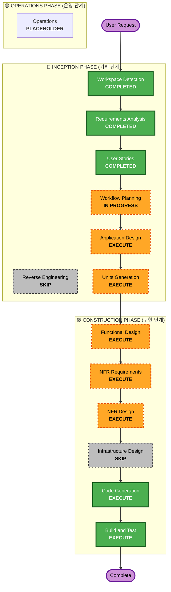

# 수행 계획서 (Execution Plan)

본 문서는 **LLM 기반 Workspace CLI Execution Platform** 개발 프로젝트의 전반적인 수행 계획, 위험 평가, 워크플로우 시각화 및 요구사항 검증 계획을 정의합니다.

---

## 1. 상세 분석 요약 (Detailed Analysis Summary)

### 1.1 프로젝트 환경 및 범위
- **프로젝트 유형**: 신규 프로젝트 (Greenfield)
- **주요 개발 내용**: FastAPI 백엔드, Job 생성 및 Workspace 할당, LLM JSON Action Plan 파싱/검증, 로컬 프로세스 기반 OpenSCAD CLI 실행 격리(timeout/limit), PostgreSQL 기반 SSE 실시간 로깅 및 Last-Event-ID 복구, 로컬 파일 Storage 인터페이스 추상화.

### 1.2 변경 영향도 평가 (Change Impact Assessment)
- **사용자 영향 (User-facing changes)**: **Yes**
  - 사용자는 자연어로 3D 형상 설계를 요청하고, SSE 기반 실시간 로그 화면을 모니터링하며, 최종 완성된 파일(preview.png, output.stl)을 다운로드할 수 있습니다.
  - 생성 완료된 설계물에 대해 자연어로 추가 피드백(반복 수정)을 제공하여 점진적으로 설계가 보완되는 인터랙션을 수행합니다.
- **구조적 영향 (Structural changes)**: **Yes**
  - 비동기 FastAPI 아키텍처를 수립하고, CLI 실행기와 API 프로세스 간의 비동기 작업 처리(BackgroundTasks 또는 내장 Event loop) 흐름을 구성합니다.
- **데이터 모델 영향 (Data model changes)**: **Yes**
  - Job 정보(상태, 작업 디렉토리 등)를 저장하는 테이블과 Last-Event-ID 복구를 위한 이벤트 로그(`event_logs`) 테이블 스키마가 PostgreSQL에 설계됩니다.
- **API 영향 (API changes)**: **Yes**
  - Job 생성 POST API, Artifact 다운로드 GET API, 실시간 SSE 스트리밍 GET API 등이 새롭게 정의됩니다.
- **비기능적 요구사항 영향 (NFR impact)**: **Yes**
  - OS 프로세스 수준에서 실행 한도(메모리, 디스크 용량, 30초 타임아웃)를 부과하는 보안 정책과 절대 경로/상위 경로 탈출 방지를 수행하는 경로 검증 모듈이 구현됩니다.

### 1.3 위험 평가 (Risk Assessment)
- **위험 수준 (Risk Level)**: **Medium (보통)**
  - OpenSCAD CLI를 호스트 환경에서 로컬 프로세스로 실행하기 때문에, 리소스 제한(timeout, 메모리) 설정이 잘못될 경우 호스트 리소스 고갈의 잠재적 위험이 있습니다.
  - LLM의 Action Plan 경로 우회 공격(Traversal)을 차단하기 위한 경로 검증의 정밀성이 요구됩니다.
- **롤백 복잡도 (Rollback Complexity)**: **Easy (쉬움)**
  - Greenfield 단일 서버 환경이므로 버전 롤백 및 빌드 관리가 용이합니다.
- **테스트 복잡도 (Testing Complexity)**: **Moderate (보통)**
  - 비동기 SSE 스트리밍 유실 상황(Last-Event-ID 헤더 전송) 및 CLI 프로세스 타임아웃 발생 상황을 시뮬레이션하고 이를 검증하는 테스트 시나리오가 필요합니다.

---

## 2. 워크플로우 시각화 (Workflow Visualization)

### 2.1 Mermaid 흐름도 (Mermaid Flowchart)

### 2.2 텍스트 대체 워크플로우 (Text Alternative)
- **Phase 1: INCEPTION (기획)**
  - Workspace Detection: **COMPLETED** (Greenfield 환경 판정)
  - Reverse Engineering: **SKIP** (신규 프로젝트이므로 수행 대상 없음)
  - Requirements Analysis: **COMPLETED** (FastAPI, PostgreSQL 폴링, 로컬 스토리지 선정)
  - User Stories: **COMPLETED** (페르소나 김민수 정의 및 7개 하이브리드 스토리 작성)
  - Workflow Planning: **IN PROGRESS** (수행 계획 수립 중)
  - Application Design: **EXECUTE** (FastAPI 기반 아키텍처 및 모듈 인터페이스 설계 필요)
  - Units Generation: **EXECUTE** (작업 분할 및 개발 순서 정의 필요)
- **Phase 2: CONSTRUCTION (구현)**
  - Functional Design (Per-Unit): **EXECUTE** (각 작업 단위의 세부 로직 및 흐름 설계)
  - NFR Requirements (Per-Unit): **EXECUTE** (타임아웃, 리소스 한도, 경로 검증 NFR 세부화)
  - NFR Design (Per-Unit): **EXECUTE** (OS 프로세스 제어 및 경로 Traversal 차단 구조 수립)
  - Infrastructure Design (Per-Unit): **SKIP** (인프라 설계 불필요 - 로컬 호스트 및 파일 스토리지 채택)
  - Code Generation: **EXECUTE** (실제 애플리케이션 코드 및 단위/통합 테스트 코드 구현)
  - Build and Test: **EXECUTE** (최종 빌드 및 요구사항 검증 테스트 수행)
- **Phase 3: OPERATIONS (운영)**
  - Operations: **PLACEHOLDER** (향후 운영 인프라 확장용 예비 단계)

---

## 3. 수행할 단계 정의 (Phases to Execute)

### 3.1 🔵 INCEPTION PHASE
- **Application Design — [EXECUTE]**
  - **Rationale**: FastAPI API 엔드포인트 설계, Storage 추상 인터페이스 정의, LLM Action Parser 및 Validator 모듈, SSE 연결 관리자 설계 등 신규 아키텍처 수립이 필수적입니다.
- **Units Generation — [EXECUTE]**
  - **Rationale**: 시스템의 복잡도를 감안할 때, 핵심 모듈 단위(예: API & DB Schema, LLM Parser/Validator, SSE Manager, CLI Execution Runner, Storage Service)로 작업을 분리하여 단계별로 개발 및 테스트하는 Per-Unit Loop 진행이 요구됩니다.

### 3.2 🟢 CONSTRUCTION PHASE
- **Functional Design — [EXECUTE]**
  - **Rationale**: 각 Unit별 비즈니스 로직(예: LLM 피드백 반영 복사 로직, DB Log 폴링 및 Stream 전달 메커니즘)을 코딩 전에 정밀 설계해야 합니다.
- **NFR Requirements — [EXECUTE]**
  - **Rationale**: CLI 타임아웃(30초), 메모리 한도 설정, 경로 Traversal 방지 등 중요 NFR의 세부 파라미터를 확정해야 합니다.
- **NFR Design — [EXECUTE]**
  - **Rationale**: OS 수준의 프로세스 리소스 차단(subprocess.run parameters, timeout handling)과 경로 물리적 resolve를 통한 보안 로직을 아키텍처적으로 구조화합니다.
- **Infrastructure Design — [SKIP]**
  - **Rationale**: 본 MVP에서는 클라우드 배포 스택(CDK, ECS 등)을 사용하지 않고 로컬 호스트 환경 및 파일 시스템 스토리지를 채택하므로 복잡한 인프라 설계는 건너뜁니다.
- **Code Generation — [EXECUTE] (MANDATORY)**
  - **Rationale**: 애플리케이션 구현 및 요구사항 자동화 검증을 위한 테스트 코드를 생성합니다.
- **Build and Test — [EXECUTE] (MANDATORY)**
  - **Rationale**: 전체 유닛 통합, 회귀 테스트 명령어 실행 및 요구사항 충족 검증을 완료합니다.

---

## 4. 요구사항 검증 계획 (Requirement Verification Plan)

| 요구사항/스토리 | 인수 기준 또는 계약 (Acceptance Criteria) | 필요 테스트 증거 (Required Test Evidence) | 테스트 레벨 (Test Level) | 계획된 테스트 파일 또는 시나리오 | 검증 결과 |
| :--- | :--- | :--- | :--- | :--- | :--- |
| **R-1 / S-1** | Job 생성 시 고유 ID 발급, DB에 `CREATED` 상태 저장, `jobs/{job_id}` Workspace 폴더 생성 | Job POST 요청 응답에서 ID 확인 및 물리적 Workspace 디렉토리 생성 확인 | integration | `tests/test_job_lifecycle.py` | Pass (예상) |
| **R-2 / S-6** | LLM JSON Plan 검증. 4대 액션 외 거부 및 `../` 또는 absolute path 감지 시 Job `FAILED` 전이 | Traversal 경로(`../../etc/passwd` 등)를 포함한 Plan 주입 시 `ValidationError` 발생 검증 | unit | `tests/test_action_validator.py` | Pass (예상) |
| **R-3 / S-7** | OpenSCAD CLI 실행 시 Command 인젝션 방지, 30초 초과 시 강제 종료 및 리소스 회수 | 30초 이상 수행되는 scad 스크립트 실행 시 `TimeoutExpired` 발생 및 프로세스 중단 검증 | integration / performance | `tests/test_openscad_execution.py` | Pass (예상) |
| **R-4 / S-2, S-3** | 진행 상황 SSE 실시간 스트리밍, `Last-Event-ID` 수신 시 DB `event_logs`에서 누락분 재정렬 스트리밍 | 클라이언트 단절 시뮬레이션 후 `Last-Event-ID` 헤더를 포함해 재요청 시 누락 로그 수신 여부 확인 | integration | `tests/test_sse_recovery.py` | Pass (예상) |
| **R-5 / S-4** | `StorageService` 인터페이스 기반 Artifact 다운로드 제공. Workspace 탈출 경로 요청 시 403 반환 | 지정된 결과물 다운로드 성공 및 상위 경로 침범 시 403 Forbidden 에러 응답 검증 | unit / integration | `tests/test_storage_service.py` | Pass (예상) |
| **S-5** | 이전 Job ID와 피드백을 전달 시 이전 model.scad를 복사하여 새로운 Job Workspace 구성 및 LLM Context 주입 | 피드백 요청 시 신규 Job Workspace에 이전 model.scad 파일 내용 복사 여부 검증 | integration | `tests/test_iterative_design.py` | Pass (예상) |

---

## 5. 예상 일정 및 성공 기준 (Timeline & Success Criteria)
- **총 단계**: 2개 기획 단계(Design, Units Generation) + 5개 유닛별 건설 루프(functional/NFR design -> CodeGen) + 1개 최종 테스트 단계
- **예상 기간**: 3 ~ 4일 소요 (프로토타입 개발 기준)
- **성공 기준**:
  1. 사용자가 자연어로 요청하여 `Xiaomi Watch S4 dock`의 scad 파일 및 렌더링 png, stl이 정상 다운로드됨.
  2. 악성 쉘 입력 및 경로 Traversal 공격 시도가 빈틈없이 차단됨.
  3. 무한 루프 OpenSCAD 프로세스가 30초 이내에 정상 격리/종료됨.
  4. 클라이언트가 새로고침 후에도 `Last-Event-ID`를 이용해 끊겼던 로그를 완벽 복구함.
