```mermaid
flowchart TD
    Start(["R-13 실행 환경 변경"])
    WD["Workspace Detection<br/><b>COMPLETED</b>"]
    RE["Reverse Engineering<br/><b>SKIP</b>"]
    RA["Requirements Analysis<br/><b>COMPLETED</b>"]
    US["User Stories<br/><b>SKIP</b>"]
    WP["Workflow Planning<br/><b>COMPLETED</b>"]
    AD["Application Design<br/><b>SKIP</b>"]
    UG["Units Generation<br/><b>SKIP</b>"]
    FD["Functional Design<br/><b>SKIP</b>"]
    NFRA["NFR Requirements<br/><b>EXECUTE</b>"]
    NFRD["NFR Design<br/><b>EXECUTE</b>"]
    ID["Infrastructure Design<br/><b>EXECUTE</b>"]
    CG["Code Generation<br/><b>EXECUTE</b>"]
    BT["Build and Test<br/><b>EXECUTE</b>"]
    OPS["Operations<br/><b>PLACEHOLDER</b>"]
    End(["R-13 완료"])

    Start --> WD --> RE --> RA --> US --> WP --> AD --> UG --> FD --> NFRA --> NFRD --> ID --> CG --> BT --> OPS --> End

    style WD fill:#4CAF50,stroke:#1B5E20,stroke-width:3px,color:#fff
    style RA fill:#4CAF50,stroke:#1B5E20,stroke-width:3px,color:#fff
    style WP fill:#4CAF50,stroke:#1B5E20,stroke-width:3px,color:#fff
    style NFRA fill:#FFA726,stroke:#E65100,stroke-width:3px,stroke-dasharray:5 5,color:#000
    style NFRD fill:#FFA726,stroke:#E65100,stroke-width:3px,stroke-dasharray:5 5,color:#000
    style ID fill:#FFA726,stroke:#E65100,stroke-width:3px,stroke-dasharray:5 5,color:#000
    style CG fill:#FFA726,stroke:#E65100,stroke-width:3px,stroke-dasharray:5 5,color:#000
    style BT fill:#FFA726,stroke:#E65100,stroke-width:3px,stroke-dasharray:5 5,color:#000
    style RE fill:#BDBDBD,stroke:#424242,stroke-width:2px,stroke-dasharray:5 5,color:#000
    style US fill:#BDBDBD,stroke:#424242,stroke-width:2px,stroke-dasharray:5 5,color:#000
    style AD fill:#BDBDBD,stroke:#424242,stroke-width:2px,stroke-dasharray:5 5,color:#000
    style UG fill:#BDBDBD,stroke:#424242,stroke-width:2px,stroke-dasharray:5 5,color:#000
    style FD fill:#BDBDBD,stroke:#424242,stroke-width:2px,stroke-dasharray:5 5,color:#000
    style OPS fill:#BDBDBD,stroke:#424242,stroke-width:2px,stroke-dasharray:5 5,color:#000
    style Start fill:#CE93D8,stroke:#6A1B9A,stroke-width:3px,color:#000
    style End fill:#CE93D8,stroke:#6A1B9A,stroke-width:3px,color:#000
    linkStyle default stroke:#333,stroke-width:2px
```

```mermaid
flowchart TD
    Start(["R-14 격리 실행 디렉토리 오류"])
    WD["Workspace Detection<br/><b>COMPLETED</b>"]
    RE["Reverse Engineering<br/><b>SKIP</b>"]
    RA["Requirements Analysis<br/><b>COMPLETED</b>"]
    US["User Stories<br/><b>SKIP</b>"]
    WP["Workflow Planning<br/><b>IN PROGRESS</b>"]
    AD["Application Design<br/><b>SKIP</b>"]
    UG["Units Generation<br/><b>SKIP</b>"]
    FD["Functional Design<br/><b>SKIP</b>"]
    NFRA["NFR Requirements<br/><b>SKIP</b>"]
    NFRD["NFR Design<br/><b>SKIP</b>"]
    ID["Infrastructure Design<br/><b>SKIP</b>"]
    CG["Code Generation<br/><b>EXECUTE</b>"]
    BT["Build and Test<br/><b>EXECUTE</b>"]
    OPS["Operations<br/><b>PLACEHOLDER</b>"]
    End(["R-14 완료"])

    Start --> WD --> RE --> RA --> US --> WP --> AD --> UG --> FD --> NFRA --> NFRD --> ID --> CG --> BT --> OPS --> End

    style WD fill:#4CAF50,stroke:#1B5E20,stroke-width:3px,color:#fff
    style RA fill:#4CAF50,stroke:#1B5E20,stroke-width:3px,color:#fff
    style WP fill:#FFA726,stroke:#E65100,stroke-width:3px,stroke-dasharray:5 5,color:#000
    style CG fill:#FFA726,stroke:#E65100,stroke-width:3px,stroke-dasharray:5 5,color:#000
    style BT fill:#FFA726,stroke:#E65100,stroke-width:3px,stroke-dasharray:5 5,color:#000
    style RE fill:#BDBDBD,stroke:#424242,stroke-width:2px,stroke-dasharray:5 5,color:#000
    style US fill:#BDBDBD,stroke:#424242,stroke-width:2px,stroke-dasharray:5 5,color:#000
    style AD fill:#BDBDBD,stroke:#424242,stroke-width:2px,stroke-dasharray:5 5,color:#000
    style UG fill:#BDBDBD,stroke:#424242,stroke-width:2px,stroke-dasharray:5 5,color:#000
    style FD fill:#BDBDBD,stroke:#424242,stroke-width:2px,stroke-dasharray:5 5,color:#000
    style NFRA fill:#BDBDBD,stroke:#424242,stroke-width:2px,stroke-dasharray:5 5,color:#000
    style NFRD fill:#BDBDBD,stroke:#424242,stroke-width:2px,stroke-dasharray:5 5,color:#000
    style ID fill:#BDBDBD,stroke:#424242,stroke-width:2px,stroke-dasharray:5 5,color:#000
    style OPS fill:#BDBDBD,stroke:#424242,stroke-width:2px,stroke-dasharray:5 5,color:#000
    style Start fill:#CE93D8,stroke:#6A1B9A,stroke-width:3px,color:#000
    style End fill:#CE93D8,stroke:#6A1B9A,stroke-width:3px,color:#000
    linkStyle default stroke:#333,stroke-width:2px
```

# 이전 실행 계획 - Hotfix R-12/13/14

> 현재 활성 실행 계획은 이 문서 하단의 **Hotfix R-15 (OpenSCAD 코드 생성 제약 강화 및 SCAD 정적 검증기 추가)**입니다.

## 상세 분석 요약

### 변경 범위
- **변경 유형**: 브라운필드 설정 템플릿 및 문서 핫픽스
- **주요 변경**: `.env.sample`을 ASCII-only 템플릿으로 변경하고 사용 규칙을 문서화
- **관련 파일**: `.env.sample`, `README.md`, 신규 정적 검증 테스트

### 영향 평가
- **사용자 화면/API 변경**: 없음
- **런타임 코드 변경**: 없음
- **데이터 모델 변경**: 없음
- **환경 설정 정책 변경**: 있음 - `.env`의 주석과 값은 ASCII 문자만 사용
- **비기능 영향**: Windows CP949 환경에서 SlowAPI 시작 오류 재발 가능성 감소

### 컴포넌트 관계
- **템플릿**: `.env.sample`이 실제 `.env` 생성의 기준
- **안내 문서**: `README.md`가 ASCII-only 제약과 원인을 설명
- **검증**: 자동화 테스트가 `.env.sample`의 ASCII 호환성을 지속적으로 확인
- **제외 범위**: `database.py`, `limiter.py`, `requirements.txt` 및 실제 `.env`

### 위험 평가
- **위험 수준**: 낮음
- **롤백 복잡도**: 쉬움
- **테스트 복잡도**: 단순
- **잔여 위험**: 사용자가 실제 `.env`에 비ASCII 문자를 직접 추가하면 동일 오류가 재발할 수 있음

## 워크플로 시각화


### 텍스트 대체 표현

1. Workspace Detection 완료
2. Reverse Engineering 생략
3. Requirements Analysis 정책 변경 반영
4. User Stories 생략
5. Workflow Planning 승인 완료
6. Application Design, Units Generation 및 Construction 설계 단계 생략
7. Code Generation에서 템플릿, 문서, 정적 검증 테스트 변경
8. Build and Test에서 정적 검증 및 전체 회귀 수행
9. Operations는 Placeholder로 종료

## 단계 계획

### INCEPTION PHASE
- [x] Workspace Detection - 완료
- [x] Reverse Engineering - 생략: 기존 구조가 명확한 단순 핫픽스
- [x] Requirements Analysis - 사용자 정책 변경 반영
- [x] User Stories - 생략: 사용자 흐름이나 API 동작 변화 없음
- [x] Workflow Planning - 변경 계획 승인 완료
- [x] Application Design - 생략: 신규 컴포넌트나 서비스 없음
- [x] Units Generation - 생략: 단일 문서·템플릿 변경

### CONSTRUCTION PHASE
- [x] Functional Design - 생략: 신규 비즈니스 로직 없음
- [x] NFR Requirements - 생략: ASCII 호환성 정책으로 범위 확정
- [x] NFR Design - 생략: 별도 설계 패턴 불필요
- [x] Infrastructure Design - 생략: 배포 및 인프라 변경 없음
- [ ] Code Generation - 실행
- [ ] Build and Test - 실행

### OPERATIONS PHASE
- [ ] Operations - Placeholder

## 변경 순서

1. `.env.sample`: 모든 주석과 예시 값을 ASCII로 변환
2. `README.md`: 실제 `.env`의 ASCII-only 정책과 Windows/SlowAPI 제약 안내
3. 테스트: `.env.sample`의 ASCII 호환성을 검증하는 정적 테스트 추가

## 요구사항 검증 계획

| 요구사항 | 인수 기준 | 필수 테스트 증거 | 테스트 수준 | 예정 파일 또는 시나리오 | 필요 결과 |
| --- | --- | --- | --- | --- | --- |
| R-12 | `.env.sample` 전체가 ASCII | 원시 바이트의 ASCII 디코딩 성공 | unit/static | 신규 환경 템플릿 테스트 | Pass |
| R-12 | README에 제약 명시 | 문서에 ASCII-only 및 Windows/SlowAPI 원인 포함 | static/manual review | `README.md` 검토 | Pass |
| R-12 | 런타임 코드 미변경 | 관련 소스 diff 없음 | static | `database.py`, `limiter.py`, `requirements.txt` diff 확인 | Pass |
| 회귀 방지 | 기존 동작 유지 | 전체 테스트 실행 | integration | `pytest -q` | 모든 테스트 통과 |

## 예상 규모
- **실행 단계**: Code Generation, Build and Test
- **생략 단계**: Reverse Engineering, User Stories, Application Design, Units Generation, Functional Design, NFR Requirements, NFR Design, Infrastructure Design
- **작업 규모**: 소규모 템플릿·문서 핫픽스

## 성공 기준
- `.env.sample`에 비ASCII 문자가 없다.
- README가 실제 `.env`에도 같은 정책을 적용하도록 명확히 안내한다.
- 자동화 테스트가 템플릿의 비ASCII 문자 재도입을 차단한다.
- 런타임 코드와 의존성은 변경하지 않는다.
- 전체 회귀 테스트가 통과한다.

---

# 실행 계획 - Hotfix R-13 (Linux/WSL2 및 Docker Compose 표준화)

## 상세 분석 요약

### 변경 범위
- **변경 유형**: 브라운필드 런타임 제약 변경, 배포 구성 추가 및 실행 장애 수정
- **주요 변경**: Linux 전용 서버 실행, Windows 로컬 개발의 WSL2 제한, OpenSCAD 포함 Docker 이미지와 Docker Compose 구성, CLI workspace 기준 실행, 서버 traceback 기록
- **관련 컴포넌트**: CLI Runner, Orchestrator, 환경 설정, Docker 배포 구성, 개발·운영 문서, 테스트
- **데이터베이스**: 기존 외부 DB를 `DATABASE_URL`로 연결하며 Compose에 DB 서비스는 추가하지 않음

### 영향 평가
- **사용자 화면 변경**: 없음
- **API 계약 변경**: 없음
- **데이터 모델 변경**: 없음
- **구조 변경**: Docker Compose 기반 배포 단위와 영속 workspace volume 추가
- **런타임 변경**: 네이티브 Windows 지원 제외, Linux/WSL2/Docker만 지원
- **비기능 영향**: 배포 재현성, 장애 관측성, 비밀정보 처리 및 workspace 영속성 개선

### 컴포넌트 관계
- **Docker Compose**: 애플리케이션 컨테이너의 환경 변수, 포트, volume, healthcheck를 조정
- **Docker 이미지**: Python 애플리케이션과 Linux OpenSCAD CLI를 패키징
- **외부 DB**: Compose 외부에서 운영되며 컨테이너가 주입된 `DATABASE_URL`로 접속
- **CLI Runner**: Job workspace를 subprocess working directory로 사용
- **Orchestrator**: 처리된 백그라운드 예외를 EventLog와 서버 ERROR traceback에 기록
- **문서**: WSL2 직접 실행과 Docker Compose 실행 절차 및 지원 범위를 설명

### 위험 평가
- **위험 수준**: 보통
- **롤백 복잡도**: 보통 - Docker 산출물 제거와 두 소스 파일 복구로 가능
- **테스트 복잡도**: 보통 - 단위 테스트, 전체 회귀, 이미지 빌드 및 컨테이너 smoke test 필요
- **주요 위험**: OpenSCAD Linux 패키지 및 headless 렌더링, 외부 DB 네트워크 도달성, volume 권한

## 워크플로 시각화



### 텍스트 대체 표현

1. Workspace Detection 완료
2. Reverse Engineering 생략
3. Requirements Analysis 승인 완료
4. User Stories, Application Design, Units Generation, Functional Design 생략
5. NFR Requirements와 NFR Design에서 Linux 컨테이너, 보안 설정, 로깅 및 영속성 기준 확정
6. Infrastructure Design에서 Dockerfile, Docker Compose, volume, 외부 DB 연결 구조 설계
7. Code Generation에서 배포 구성, 런타임 결함, 문서 및 테스트 구현
8. Build and Test에서 단위·회귀·컨테이너 smoke test 수행
9. Operations는 Placeholder로 종료

## 단계 계획

### INCEPTION PHASE
- [x] Workspace Detection - 완료
- [x] Reverse Engineering - 생략: 기존 Unit 3/5 및 애플리케이션 설계 문서 활용
- [x] Requirements Analysis - 승인 완료
- [x] User Stories - 생략: 사용자 기능/API가 아닌 실행·배포 제약 변경
- [x] Workflow Planning - 승인 완료
- [x] Application Design - 생략: 신규 애플리케이션 컴포넌트나 서비스 없음
- [x] Units Generation - 생략: R-13 단일 통합 핫픽스로 순차 구현 가능

### CONSTRUCTION PHASE
- [x] Functional Design - 생략: 신규 비즈니스 규칙이나 데이터 모델 없음
- [x] NFR Requirements - 승인 완료
- [x] NFR Design - 승인 완료
- [x] Infrastructure Design - 승인 완료
- [x] Code Generation - 승인 완료
- [x] Build and Test - 승인 완료: 56 tests 통과, container acceptance N/A

### OPERATIONS PHASE
- [x] Operations - Placeholder 완료

## 변경 순서

1. NFR Requirements: Linux/WSL2 지원 계약과 컨테이너 품질 기준 확정
2. NFR Design: 외부 설정, 비밀정보, 로깅, workspace 영속성 패턴 정의
3. Infrastructure Design: 앱 전용 Docker Compose 서비스와 이미지 구조 설계
4. Docker 배포 구성: `Dockerfile`, `docker-compose.yml`, `.dockerignore`
5. CLI Runner: Job workspace `cwd` 적용
6. Orchestrator: `job_id` 포함 ERROR traceback 로깅
7. 환경·문서: `.env.sample` 및 README의 WSL2/Docker Compose 실행 안내
8. 테스트: 단위 테스트, 전체 회귀, 이미지 빌드 및 Compose smoke test

## 요구사항 검증 계획

| 요구사항 | 인수 기준 | 필수 테스트 증거 | 테스트 수준 | 예정 파일 또는 시나리오 | 필요 결과 |
| --- | --- | --- | --- | --- | --- |
| R-13 | Linux 이미지에 Python 앱과 OpenSCAD 포함 | Compose 이미지 빌드와 OpenSCAD 버전 확인 | container smoke | `docker compose build`, 컨테이너 내 `openscad --version` | Pass |
| R-13 | Compose에 앱 서비스만 존재 | DB 서비스 부재와 외부 `DATABASE_URL` 주입 확인 | static/integration | `docker-compose.yml` 검증 | Pass |
| R-13 | 비밀정보가 이미지에 미포함 | Dockerfile과 Compose에 실제 비밀 값 부재 확인 | static/security | 배포 파일 검사 | Pass |
| R-13 | workspace 영속성 | `.workspaces` volume 연결 확인 | integration | Compose volume 검사 및 재시작 시 파일 유지 | Pass |
| R-13 | CLI가 Job workspace 기준으로 실행 | subprocess `cwd` 인자 검증 | unit | `tests/test_unit_3.py` | Pass |
| R-13 | 서버 traceback 기록 | ERROR 로그에 `job_id`, 예외 타입, traceback 포함 | unit | `tests/test_unit_5.py` | Pass |
| R-13 | 기존 API/SSE 계약 유지 | 전체 테스트 실행 | regression | `pytest -q` | 모든 테스트 통과 |
| R-13 | 실제 CLI 산출물 생성 | 유효한 SCAD 입력을 STL 또는 PNG로 변환 | container smoke | Docker Compose Job 실행 또는 컨테이너 CLI smoke | Pass |

## 성공 기준

- 네이티브 Windows를 지원 범위에서 제외하고 WSL2와 Linux 실행 절차가 명확하다.
- `docker compose up`으로 OpenSCAD 포함 애플리케이션이 시작된다.
- Compose는 DB를 생성하지 않고 기존 외부 DB 연결 정보를 사용한다.
- Job workspace와 artifact가 volume에 보존된다.
- CLI 상대경로가 Job workspace에서 해석된다.
- 오케스트레이션 실패 traceback이 서버 로그에 남는다.
- 전체 테스트와 컨테이너 smoke test가 통과한다.

---

# 실행 계획 - Hotfix R-14 (Docker 격리 실행 시 하위 디렉토리 미생성 및 복사 누락 수정)

## 상세 분석 요약

### 변경 범위
- **변경 유형**: 브라운필드 CLI Runner 실행 격리 로직 버그 수정
- **주요 변경**: `/tmp` 격리 실행 디렉토리 생성 시 workspace의 하위 디렉토리 구조 복제, `args`에 지정된 출력 경로 중 누락된 하위 디렉토리를 `/tmp` 내에 생성, CLI 실행 완료 후 새로 생성된 디렉토리와 파일을 workspace로 재귀 복사.
- **관련 파일**: `runner/service.py`, `tests/test_unit_3.py`

### 영향 평가
- **사용자 화면 변경**: 없음
- **API 계약 변경**: 없음
- **데이터 모델 변경**: 없음
- **구조 변경**: 없음
- **런타임 변경**: 격리 실행 시 하위 디렉토리 생성 및 결과물 재귀 복사
- **비기능 영향**: 안정적인 컨테이너 격리 실행 보장

### 컴포넌트 관계
- **CLI Runner**: `/tmp` 임시 폴더에서 실행하기 전 하위 디렉토리 생성 및 실행 결과물(디렉토리 트리 포함)을 workspace로 복사하는 역할 수행.
- **테스트**: 하위 디렉토리가 포함된 CLI 실행 결과를 정상적으로 보존하는지 검증.

### 위험 평가
- **위험 수준**: 낮음
- **롤백 복잡도**: 쉬움 - `runner/service.py` 복구로 가능
- **테스트 복잡도**: 단순 - 단위/통합 테스트 케이스 추가 및 전체 회귀 테스트 실행

## 워크플로 시각화



### 텍스트 대체 표현
1. Workspace Detection 완료
2. Reverse Engineering 생략
3. Requirements Analysis 승인 완료
4. User Stories, Application Design, Units Generation 및 Construction 설계 단계 생략
5. Code Generation에서 `/tmp` 하위 디렉토리 생성 및 결과물 재귀 복사 구현
6. Build and Test에서 단위·통합 및 전체 회귀 테스트 실행
7. Operations는 Placeholder로 종료

## 단계 계획

### INCEPTION PHASE
- [x] Workspace Detection - 완료
- [x] Reverse Engineering - 생략
- [x] Requirements Analysis - 승인 완료
- [x] User Stories - 생략
- [ ] Workflow Planning - 진행 중
- [ ] Application Design - 생략
- [ ] Units Generation - 생략

### CONSTRUCTION PHASE
- [ ] Functional Design - 생략
- [ ] NFR Requirements - 생략
- [ ] NFR Design - 생략
- [ ] Infrastructure Design - 생략
- [ ] Code Generation - 실행 (ALWAYS)
- [ ] Build and Test - 실행 (ALWAYS)

### OPERATIONS PHASE
- [ ] Operations - Placeholder

## 요구사항 검증 계획

| 요구사항 | 인수 기준 | 필수 테스트 증거 | 테스트 수준 | 예정 파일 또는 시나리오 | 필요 결과 |
| --- | --- | --- | --- | --- | --- |
| R-14 | 실제 장애 케이스 호환 | `run_tool` 호출 시 `["-o", "dice_design/octahedron_dice.stl", "dice_design/octahedron_dice.scad"]` 형태의 하위 입출력 경로 성공 검증 | unit/integration | `tests/test_unit_3.py` | Pass |
- 기존의 timeout, resource limit, Path Traversal 방어 로직을 완벽히 유지한다.
- 기존 회귀 테스트 및 신규 방어 테스트를 포함한 전체 테스트가 통과한다.

---

# 실행 계획 - Hotfix R-15 (OpenSCAD 코드 생성 제약 강화 및 SCAD 정적 검증기 추가)

## 상세 분석 요약

### 변경 범위
- **변경 유형**: LLM 시스템 프롬프트 개선 및 구문 안정성 검증기(Lightweight Static Validator) 추가
- **주요 변경**: 시스템 프롬프트 제약 조건 주입, ScadStaticValidator 모듈 추가, LLM Plan Validation 단계 및 2중 보안 검증 단계에 scad 정적 검증 연동, LLM Plan Validation 예외 처리 및 refinement loop 피드백 복구 기능 보완.
- **관련 파일**: `llm/client.py`, `llm/retry.py`, `llm/validator.py`, `llm/scad_validator.py` [NEW], `tests/test_unit_2.py`, `tests/test_unit_5.py`

### 영향 평가
- **사용자 화면 변경**: 없음
- **API 계약 변경**: 없음
- **데이터 모델 변경**: 없음
- **구조 변경**: 정적 검증 가드레일 추가 및 refinement 피드백 범위 구체화
- **런타임 변경**: LLM Plan validation 도중 scad 파일 생성 시 구문 검증 프로세스 추가 실행
- **비기능 영향**: 잘못된 구문(v.x, 싱글 쿼트 등)의 scad 파일이 격리 실행(/tmp) 전에 완벽 차단 및 자동 수정 재요청 성공률 증가

### 컴포넌트 관계
- **LLM Client**: `system_prompt`를 개선하여 OpenSCAD 전용 생성 제약 사항 전달.
- **ScadStaticValidator**: `WRITE_FILE` 시 `.scad` 파일을 대상 문서로 삼아 정규식/텍스트 검색으로 7가지 주요 금지 패턴 검출.
- **Retry Executor**: validation 실패 시 `LLMPlanValidationError`를 잡아 refinement loop로 피드백 메시지를 탑재해 재시도 유도.
- **SecurityPolicyValidator**: 2중 보안으로 scad 검증 실행.
- **테스트**: 정적 검증 실패/성공 및 refinement loop 정상 동작 유무에 대한 단위/통합 테스트 제공.

### 위험 평가
- **위험 수준**: 낮음
- **롤백 복잡도**: 쉬움 - scad_validator 제거 및 관련 파일 revert로 가능
- **테스트 복잡도**: 보통 - 9대 유닛 테스트와 1대 오케스트레이션 refinement 통합 테스트 실행
- **주요 위험**: 정규식 기반 검사의 false positive (예: 주석 내의 문장 오검출). 주석 stripping(//, /* */) 헬퍼를 전처리하여 이를 원천 예방함.

## 워크플로 시각화


### 텍스트 대체 표현
1. Workspace Detection 완료
2. Reverse Engineering 생략
3. Requirements Analysis 승인 완료
4. User Stories, Application Design, Units Generation 및 Construction 설계 단계 생략
5. Code Generation에서 ScadStaticValidator 작성, 프롬프트 개선 및 retry executor 연동 구현
6. Build and Test에서 단위·통합 및 전체 회귀 테스트 실행
7. Operations는 Placeholder로 종료

## 단계 계획

### INCEPTION PHASE
- [x] Workspace Detection - 완료
- [x] Reverse Engineering - 생략
- [x] Requirements Analysis - 승인 완료
- [ ] Workflow Planning - 진행 중
- [ ] Application Design - 생략
- [ ] Units Generation - 생략

### CONSTRUCTION PHASE
- [ ] Functional Design - 생략
- [ ] NFR Requirements - 생략
- [ ] NFR Design - 생략
- [ ] Infrastructure Design - 생략
- [ ] Code Generation - 실행 (ALWAYS)
- [ ] Build and Test - 실행 (ALWAYS)

### OPERATIONS PHASE
- [ ] Operations - Placeholder

## 변경 순서

1. `llm/scad_validator.py` [NEW]: 주석 제거 기능 및 7대 규칙 검사기 작성
2. `llm/client.py`: system_prompt에 구문/설명글/마크다운 펜스 금지 제약 추가
3. `llm/retry.py`: `generate_actions`에서 scad validation 호출 및 `LLMPlanValidationError` catch 후 refinement loop에 feedback 반영 연동
4. `llm/validator.py`: `SecurityPolicyValidator.validate_actions` 내부에서도 2중 방어로 scad validation 실행 보장
5. `tests/test_unit_2.py`: ScadStaticValidator에 대한 9대 유닛 테스트 케이스 생성
6. `tests/test_unit_5.py`: refinement 루프 정상 작동 검증 통합 테스트 생성
7. pytest 전체 58개 테스트 회귀 및 신규 10개 테스트 동작 검증 수행

## 요구사항 검증 계획

| 요구사항 | 인수 기준 | 필수 테스트 증거 | 테스트 수준 | 예정 파일 또는 시나리오 | 필요 결과 |
| --- | --- | --- | --- | --- | --- |
| R-15 | `v.x` 속성 접근 차단 | `point.x` 매칭 시 `LLMPlanValidationError` 발생 | unit | `tests/test_unit_2.py` | Pass |
| R-15 | 싱글 쿼트 `'` 차단 | `'` 포함 시 `LLMPlanValidationError` 발생 | unit | `tests/test_unit_2.py` | Pass |
| R-15 | 라디안 변환 수식 차단 | `180 / PI`, `PI / 180` 등 포함 시 `LLMPlanValidationError` 발생 | unit | `tests/test_unit_2.py` | Pass |
| R-15 | 마크다운 펜스 ``` 차단 | ``` 포함 시 `LLMPlanValidationError` 발생 | unit | `tests/test_unit_2.py` | Pass |
| R-15 | prose 설명글 차단 | `Here is`, `다음은` 등 prose 시작 시 `LLMPlanValidationError` 발생 | unit | `tests/test_unit_2.py` | Pass |
| R-15 | 빈 파일 차단 | content가 공백이거나 비었을 때 차단 | unit | `tests/test_unit_2.py` | Pass |
| R-15 | 최소 OpenSCAD 구조 검증 | module 등 openSCAD 키워드가 없을 때 차단 | unit | `tests/test_unit_2.py` | Pass |
| R-15 | 정상 SCAD 허용 | 올바른 SCAD 구문 통과 | unit | `tests/test_unit_2.py` | Pass |
| R-15 | 주석 내 금지 패턴 허용 | `// point.x` 등 주석 처리 시 오경보 없이 통과 | unit | `tests/test_unit_2.py` | Pass |
| R-15 | refinement 연동 성공 | 1차 실패 후 에러 피드백을 llm에 전달하여 2차에 정상 동작 보장 | integration | `tests/test_unit_5.py` | Pass |
| 회귀 방지 | 기존 동작 유지 | 전체 테스트 실행 | regression | `pytest` | 모든 테스트 통과 (58개 이상) |

## 성공 기준
- LLM 시스템 프롬프트에 마크다운 펜스, 설명글, 벡터 속성 접근 금지 및 더블 쿼트 필수화, degree 직접 사용 규칙이 주입된다.
- `ScadStaticValidator`가 scad 파일에 대해 7가지 검증 실패 규칙을 완벽하게 검증한다.
- 검사 도중 주석(`//`, `/* */`)에 기술된 문장으로 인한 false positive가 발생하지 않는다.
- 정적 검증 실패 시 `LLMPlanValidationError`가 정확하게 발생하며, refinement loop를 통해 에러 피드백이 LLM에 복구용 단서로 전달된다.
- 기존의 모든 보안/비기능 요건이 유지되고 신규 테스트 및 기존 58개 테스트가 모두 성공한다.

